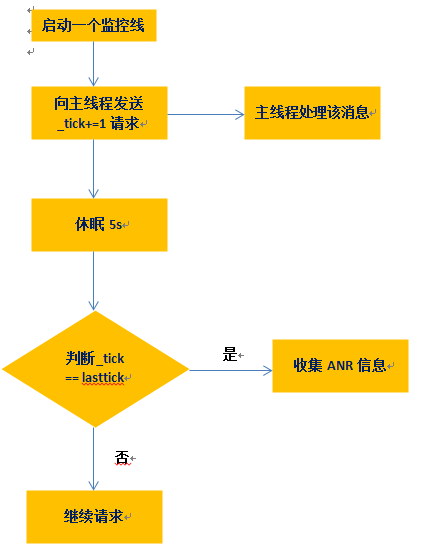
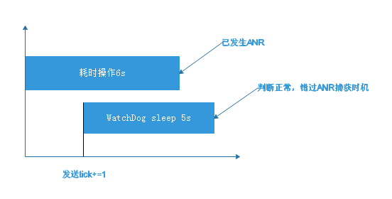

## ANR-WatchDog 使用介绍

ANR-WatchDog 一个用于检测 Android ANR (应用不响应)的 watchdog，它是参考 Android WatchDog 机制（com.android.server.WatchDog.java）创建一个监測线程，持续循环不断的往 UI 线程中 Post 一个 Runnable（修改一个数的大小），然后在规定时间之后检测这个 Runnable 是否被执行（数的大小有没有被修改过来）。没有被执行的话说明主线程执行上一个 Message 超时，然后获取当前堆栈信息。相比 BlockCanary， ANR-WatchDog 的原理更加简单，但是根据使用情况来看准确性不及 BlockCanary 高，而且可设置的配置不如 BlockCanary 丰富；

   

**优点：**

1. 兼容性好，各个机型版本通用
2. 无需修改APP逻辑代码，非侵入式
3. 逻辑简单，性能影响不大

**缺点：**

无法保证能捕捉所有ANR，对阈值的设置直接影响捕获概率。如图:

   

如果对线程的堵塞大于10s则设置监控阈值5s能捕获所有ANR，堵塞时间在5s~10s，则可能出现无法捕获场景。

### 使用

1. gradle 配置

	compile 'com.github.anrwatchdog:anrwatchdog:1.4.0'

2. application 调用

	new ANRWatchDog().start();

[GitHub地址](https://github.com/SalomonBrys/ANR-WatchDog)