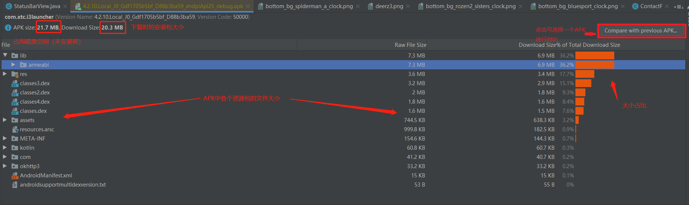
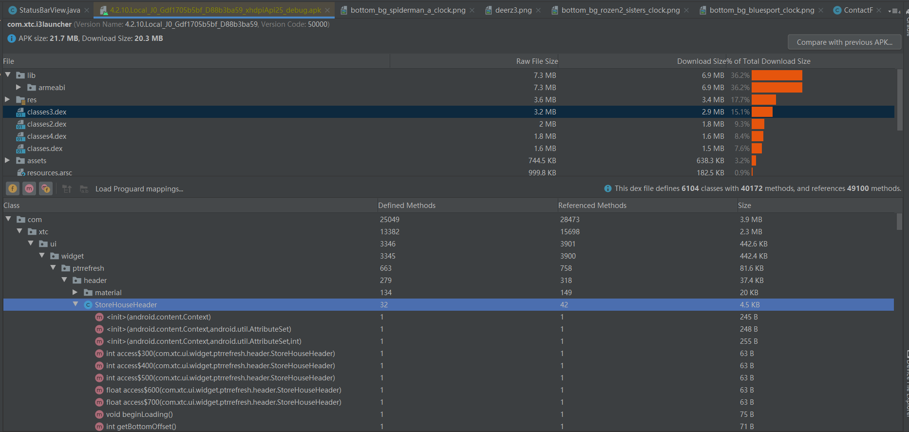
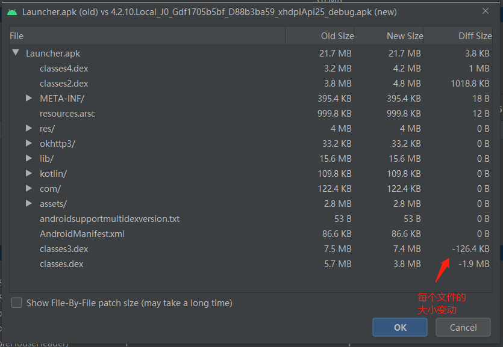

## Analyze Apk使用介绍

 - Analyze Apk 工具，通过 android studio -> build -> Analyze Apk 可以启动。
 - Analyze Apk 工具是一个逆向分析工具，主要对现有app包进行分析，包括结构、各个模块所占用的空间大小，各个模块所占用空间的百分比等
 - Analyze Apk可以比较 2个 安装包的差异，例如可以用来比较分析上个版本的安装包 和 当前安装包，从而可以分析哪些地方进行了更改，根据差异数据分析，是否有优化的地方。

**以下以 Launcher 安装包进行分析：**

 - Analyze Apk分析总包图：

   

通过选择某个 dex 文件能够显示里面包含的每个 package 大小，继续展开能直接看到某个类甚至是方法的大小，如下：
 

   

 - Analyze Apk 工具 还能对前后版本的安装包进行差异化分析，根据分析结果可以知道哪种地方做了变动，根据业务需求可以找出优化地方，例如减少空间大小。

   

