## Android Profile 使用介绍

Android Profiler 主要用于帮助开发者进行应用的 CPU、内存、网络和能耗分析。

### 1 启动 ProFile

要打开 Android Profiler 窗口，请按以下步骤操作：

1. 点击工具栏中的 Profiler（也可以点击 View > Tool Windows > Profiler ）。

2. 在 Android Profiler 窗口顶部选择想要分析的设备和应用进程，如下图所示。

   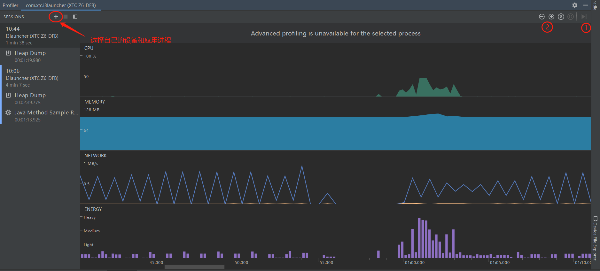

①  实时更新跳转按钮

②  时间线缩放控件

如果显示“Advanced profiling is unavailable for the selected process”，可以在顶层工具栏中点击 **Profile 'app'** 来运行，或者在运行配置中启用高级分析，按以下步骤操作：

1. 选择 **Run** > **Edit Configurations**。

2. 在左侧窗格中选择您的应用模块。

3. 点击 **Profiling** 标签，然后勾选 **Enable advanced profiling**。

重新构建并运行应用即可。

### 2 CPU Profiler

CPU Profiler 可帮助实时检查应用的 CPU 使用率和线程 Activity，并记录函数跟踪，以便优化和调试应用代码。

#### 2.1 CPU Profiler 概览

   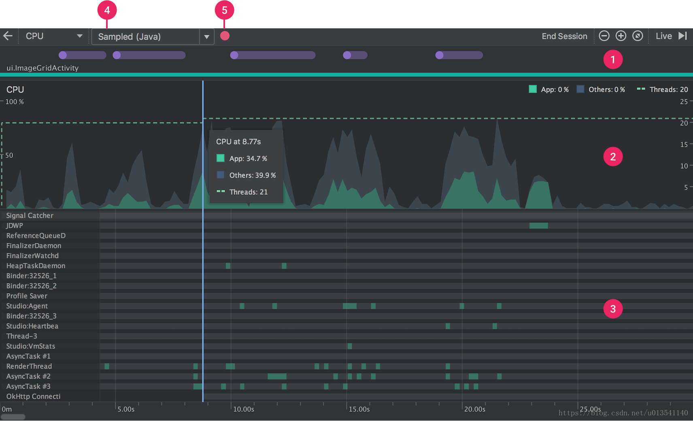

如上图所示，CPU Profiler 的默认视图包括以下内容：

① **Event 时间线**： 显示应用中在其生命周期转换的 Activity，并显示用户与设备的交互，包括屏幕旋转 Event。

② **CPU 时间线**： 显示应用的实时 CPU 使用率（占总可用 CPU 时间的百分比）以及应用使用的总线程数。 此时间线还显示其他进程的 CPU 使用率（如系统进程或其他应用），以便可以将其与自己的应用使用率进行对比。 通过沿时间线的水平轴移动鼠标，还可以检查历史 CPU 使用率数据。

③ **线程 Activity 时间线**： 列出属于应用进程的每个线程。下面说明不同的颜色对应的含义：

 - **绿色**： 表示线程处于活动状态或准备使用 CPU。 即，它正在“运行中”或处于“可运行”状态。
 - **黄色**： 表示线程处于活动状态，但它正在等待一个 I/O 操作（如磁盘或网络 I/O），然后才能完成它的工作。
 - **灰色**： 表示线程正在休眠且没有消耗任何 CPU 时间。 当线程需要访问尚不可用的资源时偶尔会发生这种情况。 线程进入自主休眠或内核将此线程置于休眠状态，直到所需的资源可用。
 
④ **记录配置**： 选择分析器记录函数跟踪的方式，如下：

 - **Sampled**： 以固定周期记录。在应用执行期间频繁捕获应用的调用堆栈。 分析器比较捕获的数据集以推导与应用代码执行有关的时间和资源使用信息。 基于“Sampled”的跟踪的问题是，如果应用在捕获调用堆栈后进入一个函数并在下一次捕获前退出该函数，则分析器不会记录该函数调用。 如果对此类生命周期很短的跟踪函数感兴趣，应使用“Instrumented”跟踪。
 - **Instrumented**： 以函数调用时间为周期记录。在运行时设置应用以在每个函数调用的开始和结束时记录时间戳。 它收集时间戳并进行比较，以生成函数跟踪数据，包括时间信息和 CPU 使用率。 注意，与设置每个函数关联的开销会影响运行时性能，并可能会影响分析数据，对于生命周期相对较短的函数，这一点更为明显。 此外，如果应用短时间内执行大量函数，则分析器可能会迅速超出它的文件大小限制，且不能再记录更多的跟踪数据。
 - **Edit configurations**： 允许更改上述“Sampled”和“Instrumented”记录配置的某些默认值，并将它们另存为自定义配置。

⑤ **记录按钮**： 用于开始和停止记录函数跟踪，最新版改为了 "Record" 按钮。

> 注： 分析器还会报告 Android Studio 和 Android 平台添加到您的应用进程（如 JDWP、Profile Saver、Studio:VMStats、Studio:Perfa 以及 Studio:Heartbeat）的线程 CPU 使用率。

#### 2.2 记录和检查函数跟踪

选择 **Sampled** 或 **Instrumented** ，然后点击 Record 开始记录函数跟踪，点击 Stop recording 结束，如下图所示。

   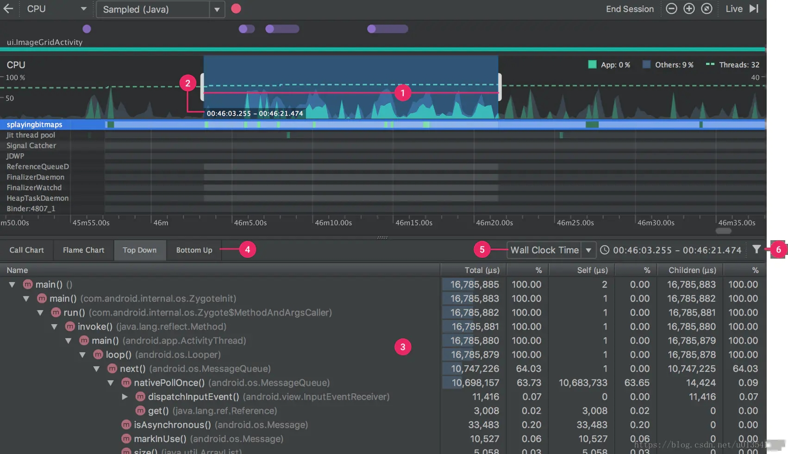

① **选择时间范围**： 确定要在跟踪窗格中检查所记录时间范围的哪一部分。 当首次记录函数跟踪时，CPU Profiler 将在 CPU 时间线中自动选择完整长度。 如果想仅检查所记录时间范围一小部分的函数跟踪数据，可以点击并拖动突出显示的区域边缘以修改其长度。

② **时间戳**： 用于表示所记录函数跟踪的开始和结束时间（相对于分析器从设备开始收集 CPU 使用率信息的时间）。 可以点击时间戳以自动选择完整记录。

③ **跟踪窗格**： 用于显示所选的时间范围和线程的函数跟踪数据。

④ 通过调用图表、火焰图、 Top Down 树或Bottom Up 树的形式显示函数跟踪。

⑤ 确定如何测量每个函数调用的时间信息：

 - **Wall clock time**：实际经过的时间。
 - **Thread time**：实际经过的时间减去线程没有消耗 CPU 资源的时间。

#### 2.3 Call Chart、Flame Chart、Top Down、Bottom Up 的含义

**Call Chart**

在 CPU Profiler 界面下半部，有四个标签页，分别对应四个不同的数据图表，它们分别是: Call Chart、Flame Chart、Top Down 和 Bottom Up。其中的 Call Chart 可能是最直白的一个，它基本上就是一个调用栈的重新组织和可视化呈现:

   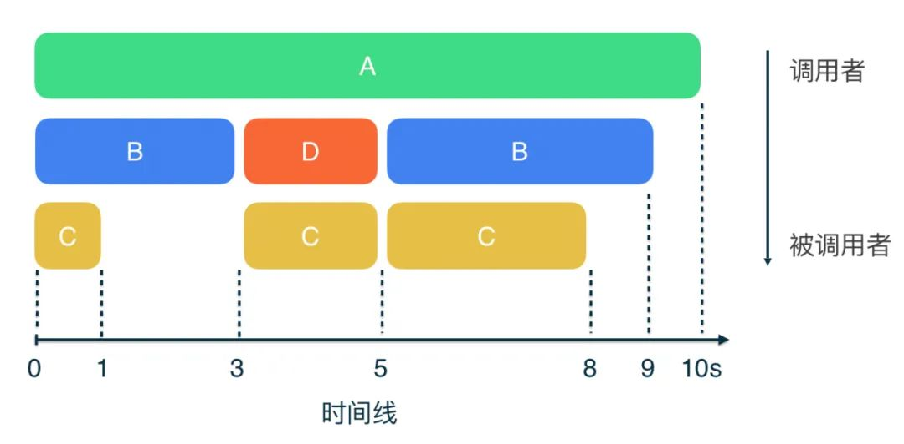

Call Chart 横轴就是时间线，用来展示方法开始与结束的确切时间，纵轴则自上而下展示了方法间调用和被调用的关系。Call Chart 已经比原数据可读性高很多，但它仍然不方便发现那些运行时间很长的代码，这时我们便需要使用 Flame Chart。

**Flame Chart**

Flame Chart 提供了一个调用栈的聚合信息。与 Call Chart 不同的是，它的横轴显示的是百分比数值。由于忽略了时间线信息，Flame Chart 可以展示每次调用消耗时间占用整个记录时长的百分比。同时纵轴也被对调了，在顶部展示的是被调用者，底部展示的是调用者。此时的图表看起来越往上越窄，就好像火焰一样，因此得名:

   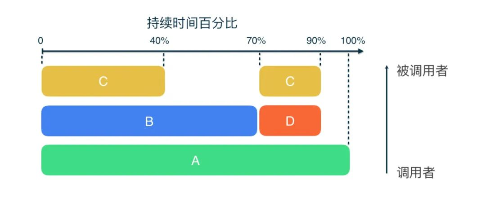

Flame Chart 是基于 Call Chart 来重新组织信息的。从 Call Chat 开始，合并相同的调用栈，以耗时由长至短对调用栈进行排序，就获得了 Flame Chart:

   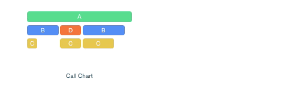

对比两种图表不难看出，左边的 Call Chart 有详细的时间信息，可以展示每次调用是何时发生的；右边的 Flame Chart 所展示的聚合信息，则有助于发现一个总耗时很长的调用路径:

   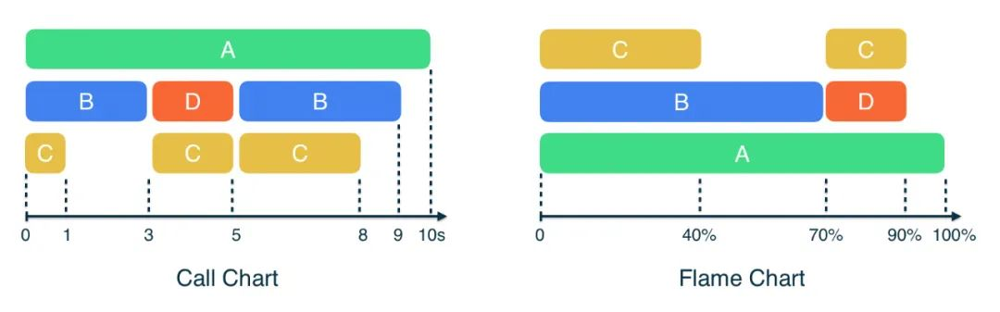

**Top Down Tree**

前面介绍的两种图表，可以帮助我们从两种角度纵览全局。而如果我们需要更精确的时间信息，就需要使用 Top Down Tree。在 CPU Profiler 中，Top Down 选项卡展示的是一个数据表格，为了便于理解其中各组数据的意义，接下来我们会尝试构建一个 Top Down Tree。

构建一个 Top Down Tree 并不复杂。以 Flame Chart 为基础，您只需要从调用者开始，持续添加被调用者作为子节点，直到整个 Flame Chart 被遍历一遍，您就获得了一个 Top Down Tree:

   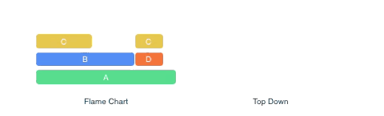

对于每个节点，我们关注三个时间信息:

   Self Time —— 运行自己的代码所消耗的时间；

   Children Time —— 调用其他方法的时间；

   Total Time —— 前面两者时间之和。

有了 Top Down Tree，我们能轻易将这三组信息归纳到一个表格之中:

   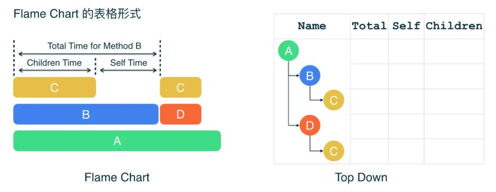

下面我们来看一看这些时间信息是怎么计算的。左手边是和前面一样的 Flame Chart 示例。右边则是一个 Top Down Tree。

我们从 A 节点开始:

   A 消耗了 1 秒钟来运行自己的代码，所以 Self Time 是 1；

   然后它消耗了 9 秒中去调用其他方法，这意味着它的 Children Time 是 9；

   这样就一共消耗了 10 秒钟，Total Time 是 10；

   B 和 D 以此类推...

值得注意的是，D 节点只是调用了 C，自己没做任何事，这种情况在方法封装时很常见。所以 D 的 Children Time 和 Total Time 都是 2。

下面是表格完全展开的状态。当您在 Android Studio 中分析应用时，CPU Profiler 会完成上面所有的计算，您只要理解这些数字是怎么产生的即可:

   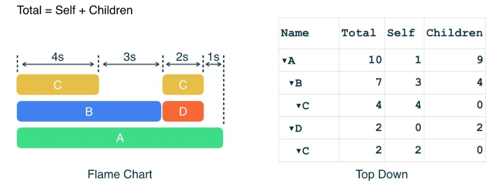

对比左右两边: Flame Chart 比较便于发现总耗时很长的调用链，而 Top Down Tree 则方便观察其中每一步所消耗的精确时间。作为一个表格，Top Down Tree 也支持按单独维度进行排序，这点同样非常实用。

**Bottom Up Tree**

当您希望方便地找到某个方法的调用栈时，Bottom Up Tree 就派上用场了。"树" 如其名，Bottom Up Tree 从底部开始构建，这样我们就能通过在节点上不断添加调用者来反向构建出树。由于每个独立节点都可以构建出一棵树，所以这里其实是森林 (Forest):

   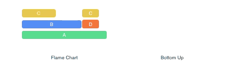

让我们再做些计算来搞定这些时间信息。

表格有四行，因为我们有四个树在森林中。从节点 C 开始:

   Self Time 是 4 + 2 = 6 秒钟；

   C 没有调用其他方法，所以 Children Time 是 0；

    前面两者相加，总时间为 6 秒钟。

看起来与 Top Bottom Tree 别无二致。接下来展开 C 节点，计算 C 的调用者 B 和 D 的情况。

在计算 B 和 D 节点的相关时间时，情况与前面的 Top Bottom Tree 有所不同:

    由于我们在构建基于 C 节点的 Bottom Up Tree，所以所有时间信息也都是基于 C 节点的。这时我们在计算 B 的 Self Time 时，应当计算 C 被 B 调用的时间，而不是 B 自身执行的时间，这里是 4 秒；对于 D 来说，则是 2 秒。

    由于只有 B 和 D 调用 C 的方法，它们的 Total Time 之和应与 C 的 Total Time 相等。

下一个树是 B 节点的 Bottom Up Tree，它的 Self Time 是 3 秒，Children Time 是用来调用其他方法的时间，这里只有 C，所以是 2 秒。Total Time 永远都是前两者之和。下面便是整个表格展开的样子:

   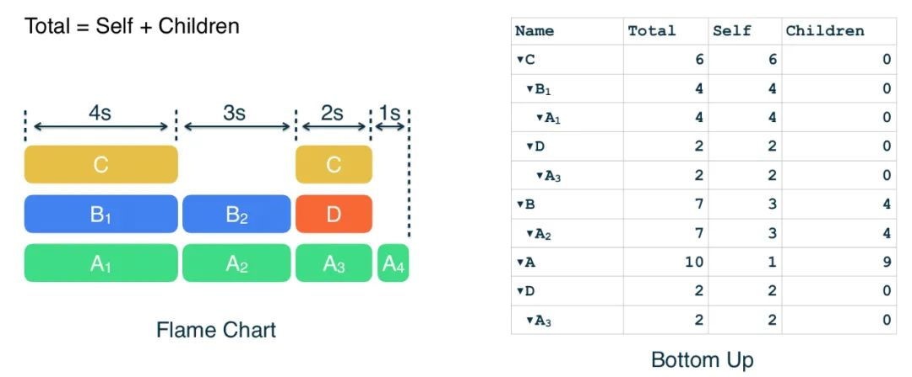

当您想要观察某个方法如何被调用，比如这个 nanoTime() 方法时，您可以使用 Bottom Up Tree 并观察 nanoTime 方法的子节点列表，通过右边的时间数据，您可以找到那个您所感兴趣的调用:

   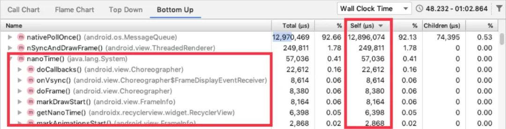

**备忘表**

前面介绍了四种不同的数据图表，并且还详细解释了一些数据是如何被计算出来的。如果您觉得头绪太多很难记住，没关系，下面这个简明的备忘表就是为您准备的:

   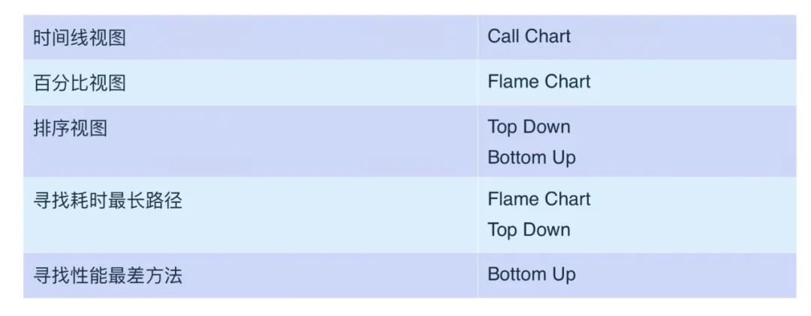

### 3 Memory Profiler

Memory Profiler 是可帮助识别导致应用卡顿、冻结甚至崩溃的内存泄漏和流失。 它显示一个应用内存使用量的实时图表，可以捕获堆转储、强制执行垃圾回收以及跟踪内存分配。

#### 3.1 Memory Profiler 概览

   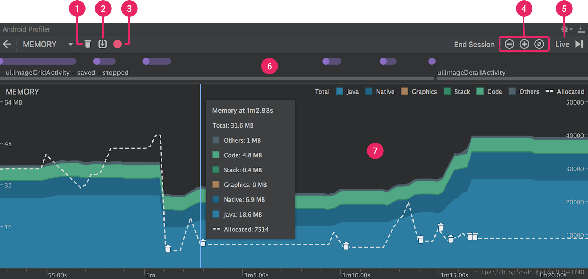

如上图所示，Memory Profiler 的默认视图包括以下各项：

① 强制执行垃圾回收 Event 。

② 捕获堆转储。

③ 记录内存分配情况。 此按钮仅在运行 Android 7.1 或更低版本的设备时才会显示。

④ 放大/缩小时间线。

⑤ 跳转至实时内存数据。

⑥ Event 时间线，其显示 Activity 状态、用户输入 Event 和屏幕旋转 Event。

⑦ 内存使用量时间线，包含以下内容：

 - 显示每个内存类别使用多少内存的堆叠图表，如左侧的 y 轴以及顶部的彩色键所示。
 - 虚线表示分配的对象数，如右侧的 y 轴所示。
 - 用于表示每个垃圾回收 Event 的图标。

   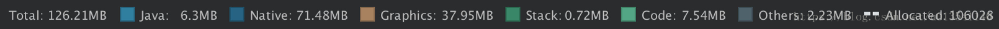

如上图，内存计数中的类别如下所示：

 - **Java**：从 Java 或 Kotlin 代码分配的对象内存。
 - **Native**：从 C 或 C++ 代码分配的对象内存。
 - **Graphics**：图形缓冲区队列向屏幕显示像素（包括 GL 表面、GL 纹理等等）所使用的内存。 （注意，这是与 CPU 共享的内存，不是 GPU 专用内存。）
 - **Stack**： 应用中的原生堆栈和 Java 堆栈使用的内存，通常与应用运行多少线程有关。
 - **Code**：应用用于处理代码和资源（如 dex 字节码、已优化或已编译的 dex 码、.so 库和字体）的内存。
 - **Other**：应用使用的系统不确定如何分类的内存。
 - **Allocated**：应用分配的 Java/Kotlin 对象数。 没有计入 C 或 C++ 中分配的对象。

> 注：目前，Memory Profiler 还会显示应用中的一些误报的原生内存使用量，而这些内存实际上是分析工具使用的。 对于大约 100000 个对象，最多会使报告的内存使用量增加 10MB。

#### 3.2 查看内存分配

Memory Profiler 可显示有关对象分配的以下信息：

 - 分配哪些类型的对象以及它们使用多少空间。
 - 每个分配的堆叠追踪，包括在哪个线程中。
 - 对象在何时被取消分配（Android 8.0+）。

如果设备运行 Android 8.0 或更高版本，可以按照下述方法查看对象分配： 只需点击并按住时间线，并拖动选择想要查看分配的区域，如下图所示：

   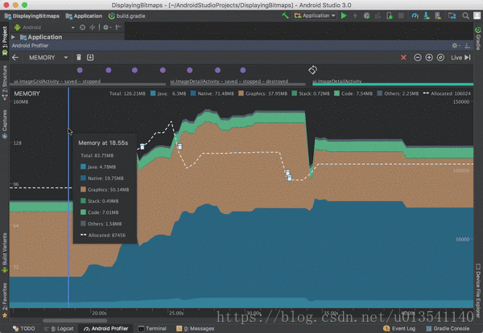

如果设备运行 Android 7.1 或更低版本，则在 Memory Profiler 工具栏中点击 Record memory allocations 。 操作完成后，点击 Stop recording 以查看分配。如下图所示：

   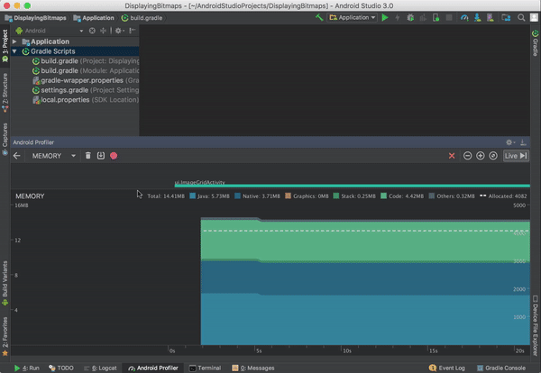

在选择一个时间线区域后，已分配对象的列表将显示在时间线下方，按类名称进行分组，并按其堆计数排序。

注：在 Android 7.1 及更低版本上，最多可以记录 65535 个分配。 如果记录超出此限值，则记录中仅保存最新的 65535 个分配。 在 Android 8.0 及更高版本中，没有此限制。

要检查分配记录，请按以下步骤操作：

1. 浏览列表以查找堆计数异常大且可能存在泄漏的对象。 点击 **Class Name** 列标题可以按字母顺序排序。 然后点击一个类名称。 此时在右侧将出现 **Instance View** 窗格，显示该类的每个实例。

2. 在 **Instance View** 窗格中，点击一个实例。 此时下方将出现 **Call Stack** 标签，显示该实例被分配到何处以及在哪个线程中，如下图所示。

3. 在 **Call Stack** 标签中，双击任意行以在编辑器中跳转到该代码。

   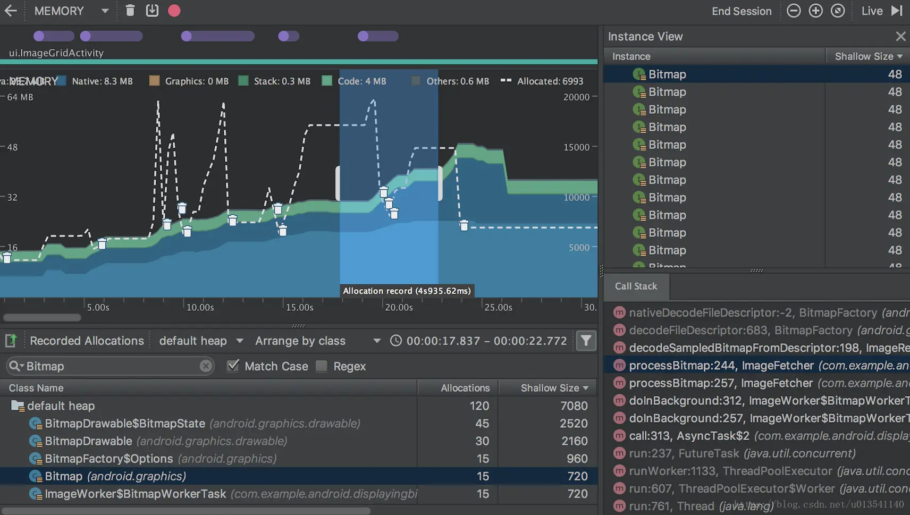

默认情况下，左侧的分配列表按类名称排列。 在列表顶部，可以使用右侧的下拉列表在以下排列方式之间进行切换：

 - **Arrange by class**：基于类名称对所有分配进行分组。
 - **Arrange by package**：基于软件包名称对所有分配进行分组。
 - **Arrange by callstack**：将所有分配分组到其对应的调用堆栈。

#### 3.3 捕获堆转储

堆转储显示在捕获堆转储时应用中哪些对象正在使用内存。 特别是在长时间的用户会话后，堆转储会显示您认为不应再位于内存中却仍在内存中的对象，从而帮助识别内存泄漏。 在捕获堆转储后，可以查看以下信息：

 - 应用已分配哪些类型的对象，以及每个类型分配多少。
 - 每个对象正在使用多少内存。
 - 在代码中的何处仍在引用每个对象。
 - 对象所分配到的调用堆栈。 （目前，如果在记录分配时捕获堆转储，则只有在 Android 7.1 及更低版本中，堆转储才能使用调用堆栈。）

要捕获堆转储，在 Memory Profiler 工具栏中点击 **Dump Java heap** 。 在转储堆期间，Java 内存量可能会暂时增加， 这很正常，因为堆转储与您的应用发生在同一进程中，并需要一些内存来收集数据。

堆转储显示在内存时间线下，显示堆中的所有类类型，如下图所示。

   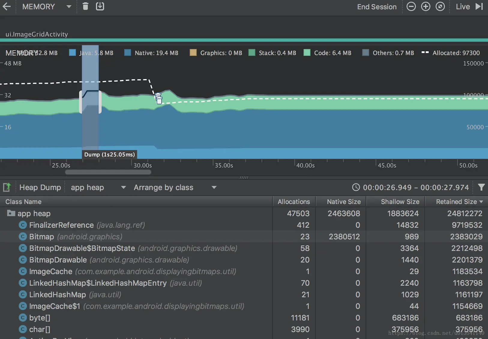

要检查堆，请按以下步骤操作：

1. 浏览列表以查找堆计数异常大且可能存在泄漏的对象。 点击 **Class Name** 列标题可以按字母顺序排序。 然后点击一个类名称。 此时在右侧将出现 **Instance View** 窗格，显示该类的每个实例。

2. 在 **Instance View** 窗格中，点击一个实例，此时下方将出现 **References**，显示该对象的每个引用。点击实例名称旁的箭头可以查看其所有字段，然后点击一个字段名称查看其所有引用。 如果要查看某个字段的实例详情，右键点击该字段并选择 **Go to Instance**，如下图所示。

3. 在 **References** 标签中，如果发现某个引用可能在泄漏内存，则右键点击它并选择 **Go to Instance**。

   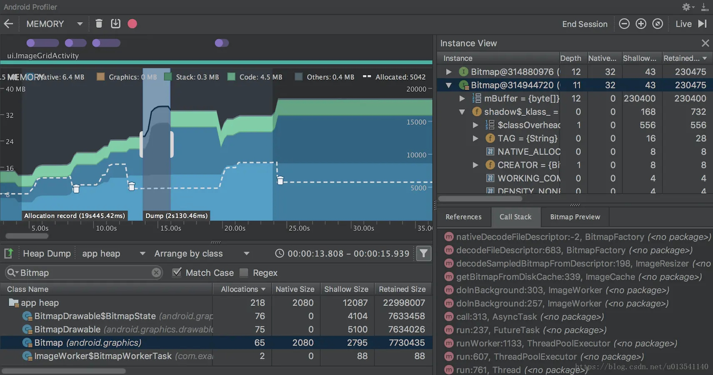

在类列表中，可以查看以下信息：

 - **Allocations**：堆中的实例数。
 - **Native Size**：此堆中所有实例的总Native占用内存大小
 - **Shallow Size**：此堆中所有实例的总大小（以字节为单位）。
 - **Retained Size**：为此类的所有实例而保留的内存总大小（以字节为单位）。

上面的几个参数下面会详细介绍

在类列表顶部，可以使用左侧下拉列表在以下堆转储之间进行切换：

 - **Default heap**：系统未指定堆时。
 - **App heap**：应用在其中分配内存的主堆。
 - **Image heap**：系统启动映像，包含启动期间预加载的类。 此处的分配保证绝不会移动或消失。
 - **Zygote heap**：写时复制堆，其中的应用进程是从 Android 系统中派生的。
默认情况下，此列表按 Retained Size 列排序，可以点击任意列标题以更改列表的排序方式。

在 **Instance View** 中，每个实例都包含以下信息：

 - **Depth**：从任意 GC root 到所选实例的最短 hop 数。
 - **Shallow Size**：此实例的大小。
 - **Retained Size**：此实例支配的内存大小。

#### 3.4 内存泄漏分析

**Activity 和 Fragment 泄漏检测**

在 Android 应用中，应当尤为警惕 Activity 和 Fragment 对象的泄漏，因为这两种对象通常都会占用很多内存。在 Android 3.6 中，Memory Profiler 加入了自动检查 Activity 和 Fragment 中的内存泄漏的功能。使用这一功能非常的简单:

首先，您需要在 Memory Profiler 中保存 Heap Dump，点击下图所示按钮:

   

在 Heap Dump 加载完成后，勾选 "Activity/Fragment Leaks" 选框:

   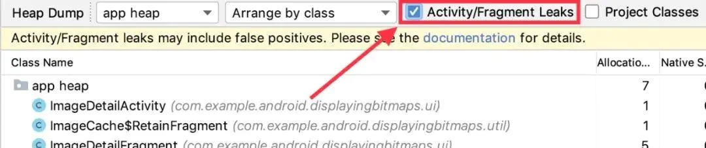

此时如果有检查到 Activity 或 Fragment 的泄漏，就会在界面中显示出来。

Memory Profiler 通过以下几种场景来判断泄漏是否发生:

    当我们销毁了一个 Activity 的实例后，这个实例就再也不会被使用了。此时如果仍然有这个 Activity 的引用，Memory Profiler 就会认为它已经泄漏；

    Fragment 的实例应当与一个 Fragment Manager 相关联，如果我们看到一个 Fragment 没有关联任何一个 Fragment Manager，而且它依然被引用时，也可以认为有泄漏发生。

不过要注意的是，针对 Fragment 有个特别的情况: 如果您载入的 Heap Dump 的时机，刚好介于 Fragment 被创建和被使用的时间之间，就会造成 Memory Profiler 误报；相同情况也会发生在 Fragment 被缓存但是没有被复用的时候。

**其他内存泄漏检测**

Memory Profiler 也可以用于检查其他类型的泄漏，它提供了许多信息，用于帮助您识别内存泄漏是否发生。

当您拿到一段 Heap Dump 之后，Memory Profiler 会展示出类的列表。对于每个类，"Allocation" 这一列显示的是它的实例数量。而在它右边则依次是 "Native Size"、"Shallow Size" 和 "Retained Size":

   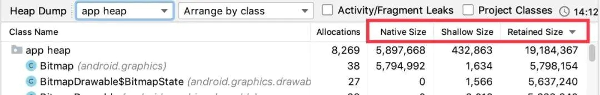

这几组数据分别意味着什么呢？下面我会通过一个例子来说明。

我们用下图来表示某段 Heap Dump 记录的应用内存状态。注意红色的节点，在这个示例中，这个节点所代表的对象从我们的工程中引用了 Native 对象:

   

这种情况不太常见，但在 Android 8.0 之后，使用 Bitmap 便可能产生此类情景，因为 Bitmap 会把像素信息存储在原生内存中来减少 JVM 的内存压力。

先从 "Shallow Size" 讲起，这列数据其实非常简单，就是对象本身消耗的内存大小，在上图中，即为红色节点自身所占内存。

而 "Native Size" 同样也很简单，它是类对象所引用的 Native 对象 (蓝色节点) 所消耗的内存大小:

   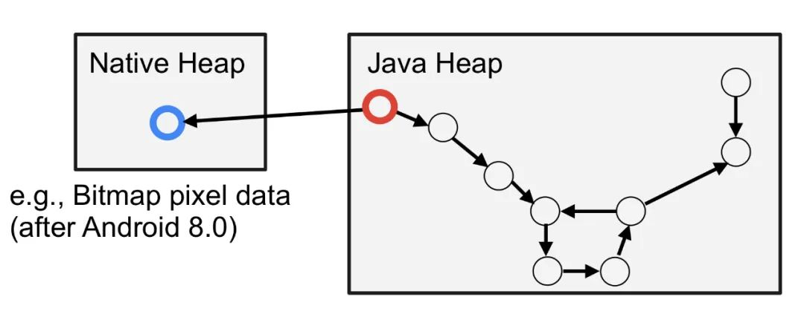

"Retained Size" 稍复杂些，它是下图中所有橙色节点的大小:

   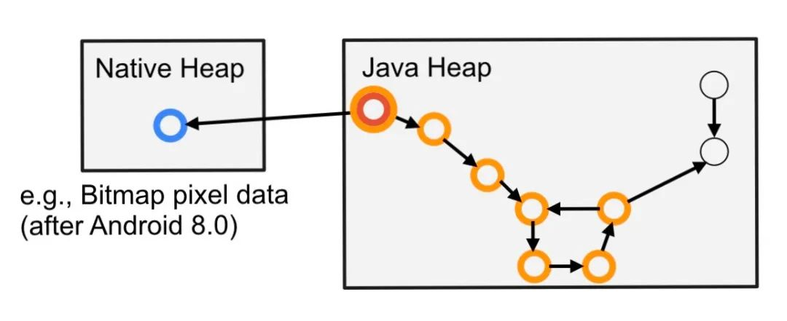

由于一旦删除红色节点，其余的橙色节点都将无法被访问，这时候它们就会被 GC 回收掉。从这个角度上讲，它们是被红色节点所持有的，因此被命名为 "Retained Size"。

还有一个前面没有提到的数据维度。当您点击某个类名，界面中会显示这个类实例列表，这里有一列新数据 —— "Depth":

   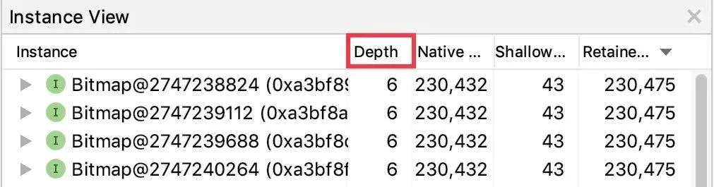

"Depth" 是从 GC Root 到达这个实例的最短路径，图中的这些数字就是每个对象的深度 (Depth):

   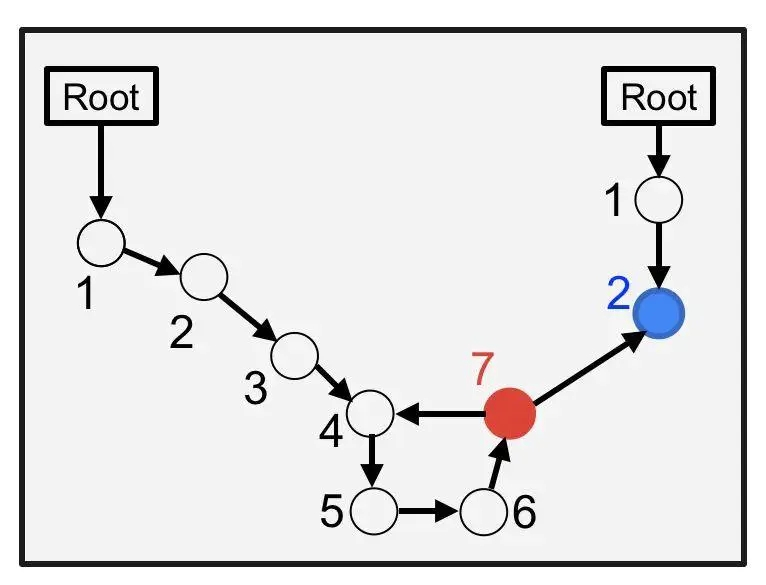

一个对象离 GC Root 越近，它就越有可能与 GC Root 有多条路径相连，也就越可能在垃圾回收中被保存下来。

以红色节点为例，如果从其左边来的任何一个引用被破坏，红色节点就会变成不可访问的状态并且被垃圾回收回收掉。而对于右边的蓝色节点来说，如果您希望它被垃圾回收，那您需要把左右两边的路径都破坏才行。

值得警惕的是，如果您看到某个实例的 "Depth" 为 1 的话，这意味着它直接被 GC root 引用，同时也意味着它永远不会被自动回收。

下面是一个示例 Activity，它实现了 LocationListener 接口，高亮部分代码 "requestLocationUpdates" 将会使用当前 Activity 实例来注册 locationManager。如果您忘记注销，这个 Activity 就会泄漏。它将永远都待在内存里，因为位置管理器是一个 GC root，而且永远都存在:

   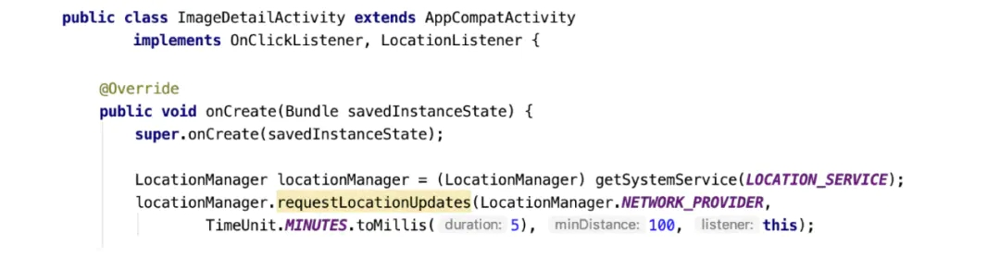

您能在 Memory Profiler 中查看这一情况。点击一个实例，Memory Profiler 将会打开一个面板来显示谁正在引用这个实例:

   

我们可以看到位置管理器中的 mListener 正在引用这个 Activity。您可以更进一步，通过引用面板导航至堆的引用视图，它可以让您验证这条引用链是否是您所预期的，也能帮您理解代码中是否有泄漏以及哪里有泄漏。

### 4 Network Profiler

Network Profiler 能够在时间线上显示实时网络 Activity，包括发送和接收的数据以及当前的连接数，便于查看应用传输数据的方式和时间，并据此对底层代码进行适当优化。

#### 4.1 Network Profiler 概览

   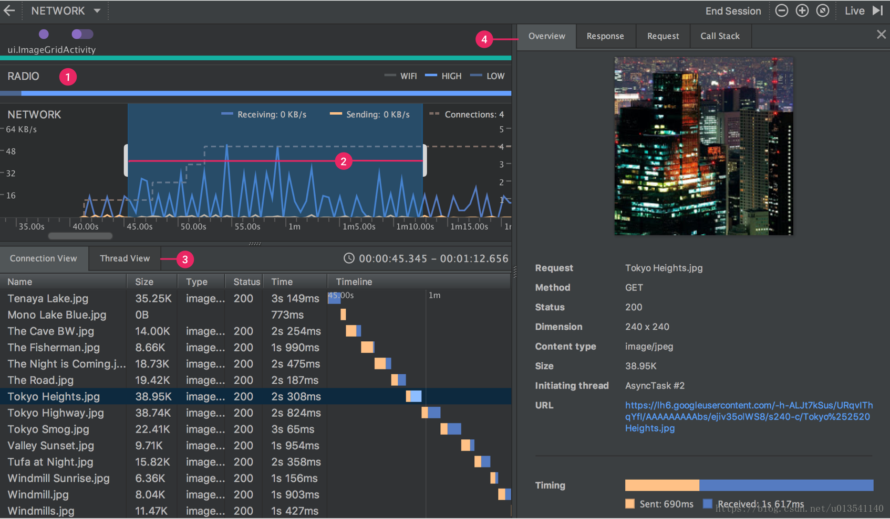

如上图所示，窗口顶部显示的是 Event 时间线以及无线装置功耗状态（低/高）与 WLAN 的对比①。 在时间线上，可以点击并拖动选择时间线的一部分来检查网络流量②。 下方的窗口③会显示在时间线的选定片段内收发的文件，包括文件名称、大小、类型、状态和时间。 可以点击任意列标题排序。 同时，还可以查看时间线选定片段的明细数据，显示每个文件的发送和接收时间。

点击网络连接的名称即可查看有关所发送或接收的选定文件的详细信息④。 点击各个标签可查看响应数据、标题信息和调用堆栈。

