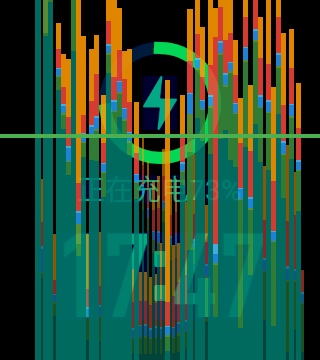
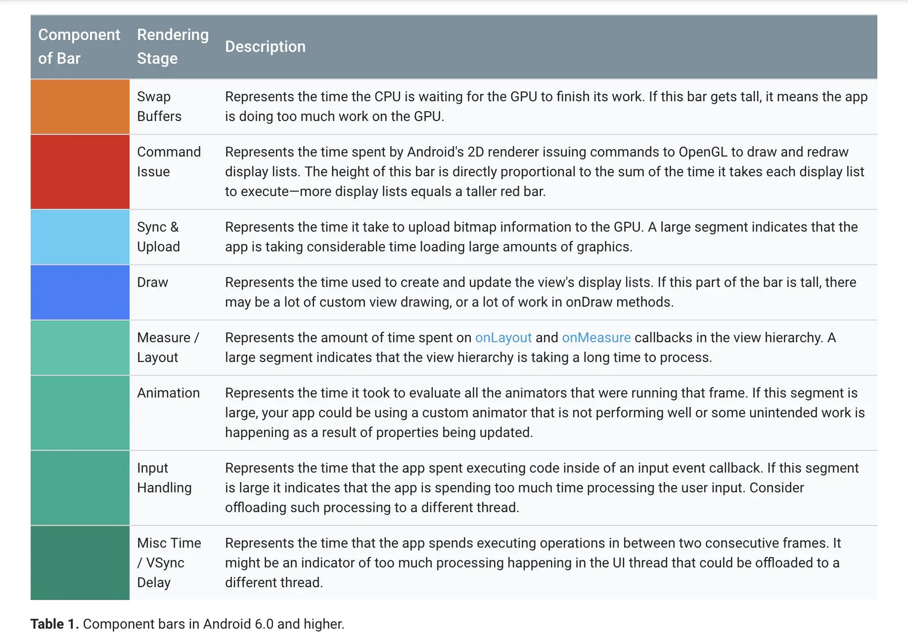

## GPU 呈现模式分析介绍

这个工具主要是用来反映界面的绘制情况，查看是否存在耗时问题。

手表连接 ADB 后，打开 perf.bat 命令（没有的可以找燚涛或者群里问下）即可，打开后手表界面会显示绘制耗时的条形图如下：

   

 - 对于每个可见的应用程序，该工具都会显示一个图表。
 - 水平轴代表的是运行经过的时间、垂直轴代表每一帧所花费的时间，以毫秒为单位。
 - 随着界面的刷新，界面上会滚动显示垂直的柱状图来表示每帧画面所需要渲染的时间，柱状图越高表示花费的渲染时间越长。
 - 中间有一根绿色的横线，表示为16毫秒。（android应用程序让用户不感觉到肉眼视觉上的卡顿，需要让其程序在其整个生命周期中，始终保持60FPS的帧速率，即为屏幕需要在1秒内刷新60次，每16.666667毫秒内刷新一次，才不会感觉到卡顿）当竖条超过该绿线，就可能让用户感觉到卡顿。

**柱状图颜色含义**

   

在Android6.0之前，柱状图主要为黄色、红色、蓝色(Swap Buffers,Command Issue,Draw)三类。自从安卓6.0之后，玄学曲线进行了改版，增加至8条数据。新版本GPU呈现分析曲线新增加了(Sync&Upload,Measure&LayoutAnimation,Input Handling,Misc/Vsync Delay)五大步骤数据。

（1）Command Issue(红色)：表示执行任务的时间，是Android进行2D渲染显示列表的时间，为了将内容绘制到屏幕上，Android需要使用Open GL ES的API接口来绘制显示列表，红色线条越高表示需要绘制的视图更多；比如我们在遇到多张图加载的时候，红色会突然跳的很高，此时滑动页面也就不流畅了，要等几秒图片才能加载出来，并不是卡住。

（2）Swap Buffers(黄色)：表示处理任务的时间，即CPU等待GPU完成任务的时间，线条越高，表示GPU做的事情越多。若橙色部分过高，说明GPU目前过于忙碌。

（3）Draw(蓝色)：表示测量和绘制视图列表所需要的时间，蓝色线条越高表示每一帧需要更新很多视图，或者View的onDraw方法中做了耗时操作。它越长说明当前视图比较复杂或者无效需要重绘，表现为卡顿。

理想的流畅状态是三色都低于绿线以下。

（4）Sync & Upload(浅蓝色)：表示的是准备当前界面上有待绘制的图片所耗费的时间，为了减少该段区域的执行时间，我们可以减少屏幕上的图片数量或者是缩小图片的大小。

下面这几种统称为绿色，随着后面标注的数字颜色逐渐加深。

（5） Measure/Layout(绿色1)表示布局的onMeasure与onLayout所花费的时间，一旦时间过长，就需要仔细检查自己的布局是不是存在严重的性能问题；。

（6）Animation(绿色2)：表示计算执行动画所需要花费的时间，包含的动画有ObjectAnimator，ViewPropertyAnimator，Transition等等。一旦这里的执行时间过长，就需要检查是不是使用了非官方的动画工具或者是检查动画执行的过程中是不是触发了读写操作等等。

（7）Input Handling(绿色3)：表示系统处理输入事件所耗费的时间，粗略等于对事件处理方法所执行的时间。一旦执行时间过长，意味着在处理用户的输入事件的地方执行了复杂的操作。

（8） Misc Time/Vsync Delay(绿色4)：表示在主线程执行了太多的任务，导致UI渲染跟不上vSync的信号而出现掉帧的情况。

