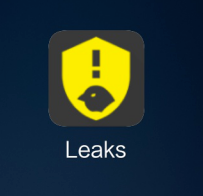
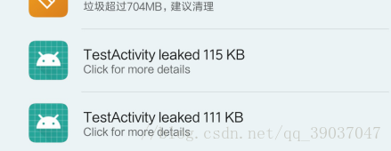
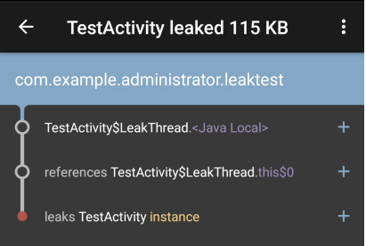

## Leakcancary 使用介绍

LeakCanary 是 Square 公司为 Android 开发者提供的一个自动检测内存泄漏的工具，LeakCanary 本质上是一个基于 MAT 进行 Android 应用程序内存泄漏自动化检测的的开源工具，我们可以通过集成 LeakCanary 到自己的工程中，一旦检测到内存泄漏，LeakCanary 就会 dump Memory 信息，并通过另一个进程分析内存泄漏的信息并展示出来，随时发现和定位内存泄漏问题，而不用每次在开发流程中都抽出专人来进行内存泄漏问题检测，极大地方便了 Android 应用程序的开发。

### 使用说明

gradle 中添加依赖

	dependencies {
	  // debugImplementation because LeakCanary should only run in debug builds.
	  debugImplementation 'com.squareup.leakcanary:leakcanary-android:2.4'
	}

application 中使用

	@Override
	public void onCreate() {
	    super.onCreate();
	    if (LeakCanary.isInAnalyzerProcess(this)) {
	        // This process is dedicated to LeakCanary for heap analysis.
	        // You should not init your app in this process.
	        return;
	    }
	    LeakCanary.install(this);
	}

在注册之前先判断 LeakCanary 是否已经运行在手机上，比如你同时有多个 APP 集成了 LeakCanary，其他 app 已经运行了 LeakCanary 则不需要重新 install。

运行 LeakCanary 后会在桌面生成一个应用图标：

   

### 监听指定对象的内存泄漏

如果想让 LeakCanary 监听指定对象的内存泄漏，我们就需要使用到 RefWatcher 的 watch 功能，使用方式如下：

 - 在 Application 的 onCreate 中调用 install 方法，并获取 RefWatcher 对象：

	private static RefWatcher sRefWatcher;
	
	@Override
	public void onCreate() {
	    super.onCreate();
	    sRefWatcher = LeakCanary.install(this);
	}
	
	public static RefWatcher getRefWatcher() {
	    return sRefWatcher;
	}

> 注意：因为这时候需要获取 sRefWatcher 对象，所以 sRefWatcher = LeakCanary.install(this) 一定需要执行，不需要判断 LeakCanary.isInAnalyzerProcess(this) 

 - 然后通过 RefWatcher 监控具体的对象：

	App.getRefWatcher().watch(obj);

obj 就是要监听的对象，比如可在 Activity 的 onDestroy() 中调用来监听该 Activity 是否泄漏，也可以在某个对象创建时监听对它进行监听。

### 内存泄漏展示页面

当发生内存泄漏，状态栏会提示你

   

点击会打开一个 Activity 界面，并详细的展示泄漏的内容，也可以点击桌面的 Leaks 图标打开相应的界面。

   

