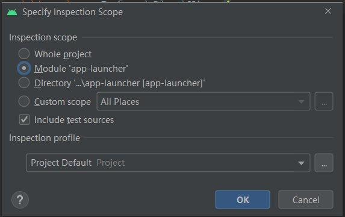
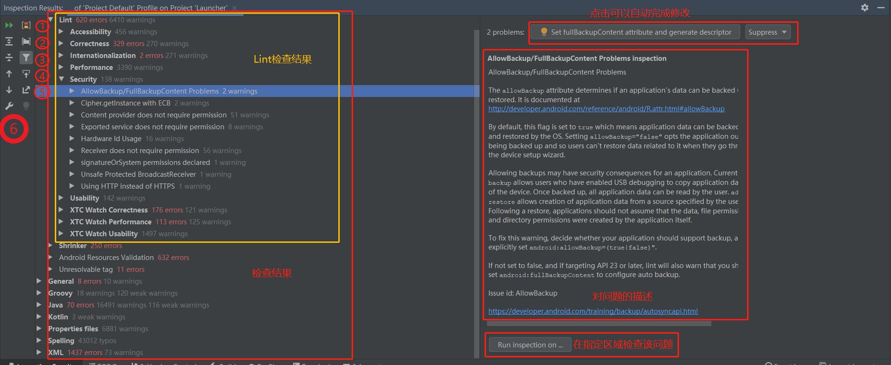

## AS Lint 工具使用介绍

Lint 是 Android Studio 自带的一个代码扫描工具，它能帮助我们识别代码的质量及安全问题。

### 具体使用

1. Analyze > Inspect Code
2. 弹出检查范围选择对话框，根据实际需要进行选择，如下图：

   

点击“OK”后，Lint 就开始启动了，AS 界面的底部会表示正在运行中，稍等一会儿就能看到检查结果了。

检测结果如图所示：

   

**工具栏：**

   1）图中①处，Group By Serverity：检查结果按照问题严重程度分组。

   2）图中②处，Group By Directory：检查结果按照目录分组。

   3）图中③处，Filter resolved items：过滤掉已经解决的问题项。

   4）图中④处，Export：导出为 HTML 或者 XML 文档。

   5）图中⑤处，navigatie with single click：单击定位

   6）图中⑥处，Edit Settings：编辑设置，通过这里可以对 Lint 进行设置，后面会详细介绍。

**检查结果区：**

 由于这里检查代码不仅仅只有 Lint 在工作，还有很多其它插件也在执行，所以结果中有很多其它工具检查出来的问题，Android > Lint下面的目录就是 Lint 的结果区了。如果展开 Lint 的结果，会发现这些问题都是 Android 所特有的问题，比如布局文件、控件、AndroidManifest 文件中的问题，可见 Lint 就是为 Android 而量身定做的。默认时这些结果是按照一定的分类来分组的，比如 Accessibility、 Correctness、 Performance、 Security 等，这问题类型是否需要检查，也是可以在设置中设置的。通过这个结果区还可以看到 Java、 Kotlin、 Spelling 等的问题，也一样解决。

不过并不是每一个问题都是必解的，除了明显问题，其它要到具体代码的上下文中去考虑是否需要修复。

**Lint问题种类：**

从设置面板中可以看到，问题可以分为如下几个大类：

（1）Accessibility 辅助选项，比如 ImageView 的 contentDescription 往往建议在属性中定义等。

（2）Compliance 合规性，违反了 Google Play 的要求，比如使用了过期的库版本，性能、安全性、 API 等级等没有遵循新系统的要求等。

（3）Correctness 不够完美的编码，比如硬编码、使用过时API等。

（4）Internationalization 国际化，直接使用汉字，没有使用资源引用等

（5）Interoperability 互操作性，比如和 Kotln 的交互等。

（6）Performanc 对性能有影响的编码，比如：静态引用，循环引用等

（7）Security 不安全的编码，比如在 WebView 中允许使用 JavaScriptInterface 等

（8）Usability 可用的，有更好的替换的 比如排版、图标格式建议.png格式等

另外 Lint 可以根据需要进行各种设置，比如指定只检查某个种类的问题等，还可以自定义 Lint 规则，这个有兴趣的可以去详细了解，这里就不作介绍了。

参考：

 [Android自定义Lint实践](https://blog.csdn.net/ouyang_peng/article/details/80374867)
