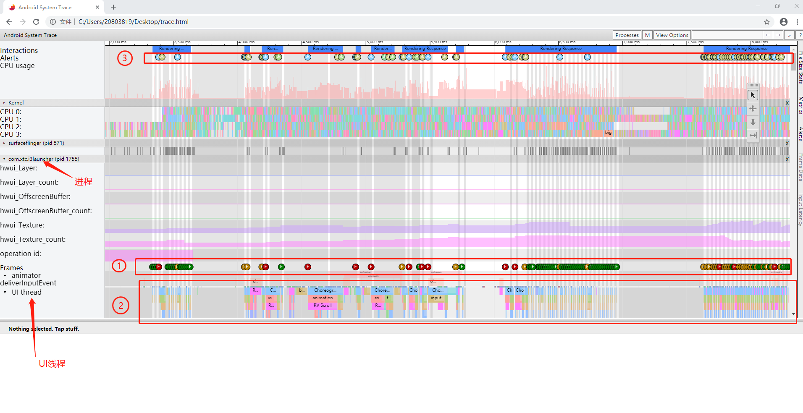

## Systrace 使用介绍

Systrace 是 Android 系统中性能分析的主要工具。它记录一段时间内的设备活动，并产生一个 HTML 格式的 Systrace 报告。它收集了 CPU 调度、磁盘操作、应用线程等信息，主要用于分析绘制性能方面的问题和分析系统关键方法和应用方法耗时。

**Systrace 原理**

 - 在系统的一些关键链路（如 SystemServcie、虚拟机、Binder 驱动）插入一些信息（Label）;
 - 通过 Label 的开始和结束来确定某个核心过程的执行时间;
 - 把这些 Label 信息收集起来得到系统关键路径的运行时间信息，最后得到整个系统的运行性能信息;
 - Android Framework里面一些重要的模块都插入了 label 信息，用户 App 中可以添加自定义的 Lable。

### 使用准备

使用 Systrace 命令前先确保已经安装 Android SDK 和 Python，Systrace 命令位于 android-sdk/platform-tools/systrace/ 中。通过 Python 脚本来运行 Systrace，Systrace.py的使用需要安装python 2.X版本 ，不能用python 3.x。

### 命令用法

开启 cmd 命令，进入 android-sdk/platform-tools/systrace/ 目录，然后执行 Systrace 命令，格式如下：

	python systrace.py [options] [category1] [category2] ... [categoryN]

#### options

其中options可取值：

| options      |    解释 |
| :-------- | :--------|
| -o < FILE>  | 指定 trace 数据文件的输出路径，如果不指定就是当前目录的 trace.html |
| -t N, –time=N     |   执行时间，默认5s |
| -b N, –buf-size=N      |    buffer 大小（单位kB),用于限制trace总大小，默认无上限 |
| -k < KFUNCS>，–ktrace=< KFUNCS>    |   追踪 kernel 函数，用逗号分隔 |
| -a < APP_NAME>, –app=< APP_NAME>    |   追踪应用包名，用逗号分隔 |
| –from-file=< FROM_FILE>    |   从文件中创建互动的systrace |
| -e < DEVICE_SERIAL>, –serial=< DEVICE_SERIAL>    |   指定设备 |
| -l, –list-categories   |   列举可用的tags |

> 备注：-a < APP_NAME>, –app=< APP_NAME>  这个选项可以开启指定包名App中自定义 Trace Label 的 Trace 功能。也就是说，如果你在代码中使用了Trace.beginSection("tag"), Trace.endSection；默认情况下，你的这些代码是不会生效的，因此，这个选项一定要开启

#### category

category可取值：

category     | 解释
-------- | ---
gfx | Graphic系统的相关信息
input    | input
view     | View绘制相关信息
webview | WebView
wm |	Window Manager
am |	Activity Manager
sm |	Sync Manager
audio |	Audio
video |	Video
camera |	Camera
hal |	Hardware Modules
app |	Application
res |	Resource Loading
dalvik |	虚拟机相关信息
rs |	RenderScript
bionic |	Bionic C Library
power |	Power Management
sched |	CPU 调度的信息
irq |	IRQ Events
freq |	CPU Frequency
idle |	CPU Idle
disk |	Disk I/O
mmc |	eMMC commands
load |	CPU Load
sync |	Synchronization
workq |	Kernel Workqueues
memreclaim |	Kernel Memory Reclaim
regulators |	Voltage and Current Regulators
core_services |	SystemServer中系统核心Service的相关信息

**命令示例:**

	python systrace.py -t 10 sched gfx view wm am app webview -a "com.xtc.i3launcher" -o mytrace.html

**具体解释如下：**

- -t：指定统计时间为10s
- shced：cpu调度信息
- gfx：图形信息
- view：视图
- wm：窗口管理
- am：活动管理
- app：应用信息
- webview：webview 信息
- -a：指定目标应用程序的包名
- -o：生成的 mytrace.html 文件，默认生成在 systrace.py 目录中，可具体指导目录

### 标签添加

将Trace.begainSection()，Trace.endSection()在想要分析的方法前后进行插桩即可，示例如下：

	public class TestApp extends Application {
	
	    @Override
	    public void onCreate() {
	        super.onCreate();
	        Trace.beginSection("AppOnCreate");
	        // ... 应用代码
	        Trace.endSection();
	    }
	}

添加之后会在生成的 HTML 报告中显示对应 Label 的耗时，这里的 Label 是"AppOnCreate"，添加的 Label 有以下需要注意：

 - begin 和 end 必须成对出现；
 - Label 支持嵌套；
 - begin 和 end 必须在同一个线程中；
 - 抓取 systrace 时，必须指定包名
 
### 分析 systrace 生成的 HTML 文件

产生的 html 格式的 trace 文件必须使用 Google Chrome 打开，才能正确地解析并已图标形式展现，如下图

   

**1. Frames**

在每个 app 进程，都有一个 Frames 行，正常情况以绿色的圆点表示。当圆点颜色为黄色或者红色时（红比黄更严重），意味着这一帧超过 16.6ms（即发现丢帧），这时需要通过放大那一帧进一步分析问题。对于 Android 5.0(API level 21) 或者更高的设备，该问题主要聚焦在 UI Thread 和 Render Thread 这两个线程当中。对于更早的版本，则所有工作在 UI Thread。

点击帧标识的圆圈使其高亮，它将提供有关系统为渲染该帧所做的工作的其他信息，包括警报。报告还显示了在渲染该帧时系统正在执行的方法，分析这些方法可以确定UI卡顿的潜在原因。

**2. 耗时方法**

显示每一帧对应的调用方法以及方法的耗时程度，通过 Trace.begainSection() 添加的自定义 Label 也会在此显示

**3. Alerts**

Systrace 能自动分析 trace 中的事件，并能自动高亮性能问题作为一个 Alerts，建议调试人员下一步该怎么做。

比如对于丢帧是，点击黄色或红色的Frames圆点便会有相关的提示信息；另外，在 systrace 的最右上方，有一个 Alerts tab 可以展开，这里记录着所有的的警告提示信息。

#### 分析 HTML 的快捷操作

**导航操作**

导航操作  |  作用
-------- | ---
W  |	放大，[+shift]速度更快
S  |	缩小，[+shift]速度更快
a  |	左移，[+shift]速度更快
d  |	右移，[+shift]速度更快

**快捷操作**

常用操作  |	作用
-------- | ---
F  |	放大当前选定区域
M  |	高亮当前选定区域耗时内容。
V  |	高亮 VSync
G  |	切换是否显示 60hz 的网格线
0  |	恢复 trace 到初始态，这里是数字0而非字母o
E  |	将当前鼠标位置在时间轴上居中

一般操作  |	作用
-------- | ---
h  |	切换是否显示详情
/  |	搜索关键字
enter  |	显示搜索结果，可通过← →定位搜索结果
`  |	显示/隐藏脚本控制台
?  |	显示帮助功能
1  |	选择模式，双击将高亮相同任务
2  |	平移模式，拖动平移视图
3  |	缩放模式，拖动鼠标实现放大/缩小
4  |	时移模式，拖动来创建或移除时间窗口线
Shift + G  |	在当前选定任务的结束处显示网格
Left Arrow  |	在当前时间轴上选择上一个事件。
Right Arrow  |	在当前时间轴上选择下一个事件。

