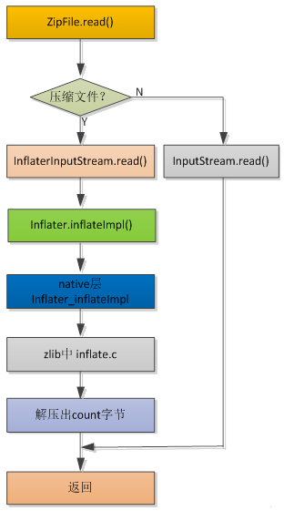
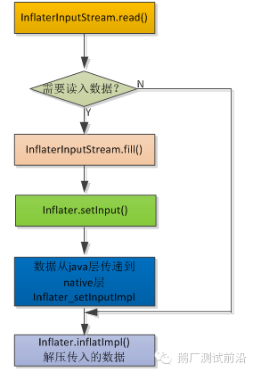
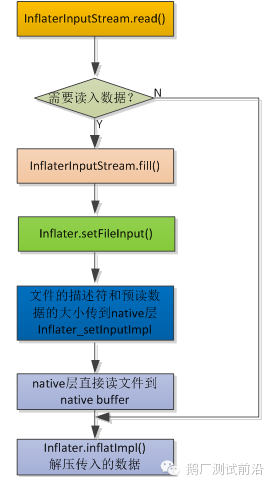
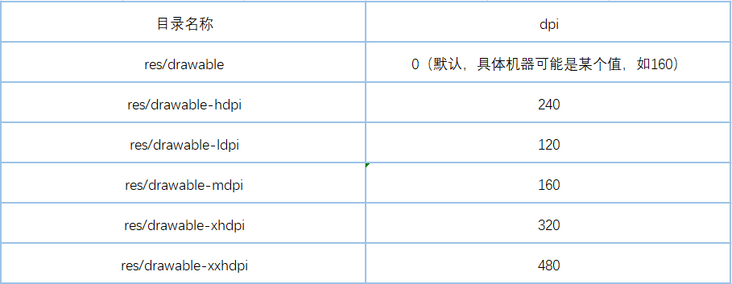
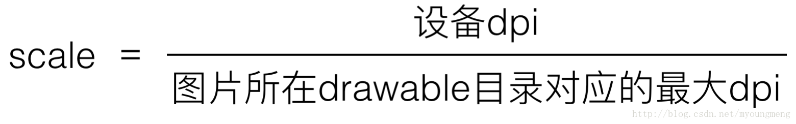

# Android 移动性能实战摘要

> 参照《Android移动性能实战》做的摘要。

性能优化的首要任务就是数据监控统计，是后续测试发现问题和针对优化的基础。

需要统计的数据如下（后续会逐渐添加完善）：

1. 启动耗时（进程启动，每个 Activity 的启动）；
2. Webview 初始化耗时，页面响应时间；
3. 卡顿监控，CPU 占用率，发生异常时的内存快照和堆栈信息；
4. 内存泄漏监控；
5. IO次数和数据量；
6. 网络资源下载耗时以及是否重复下载资源；

反映在交互上的问题如流畅度、时延等，实际上都是资源问题，例如流畅度问题，可以是内存的垃圾回收太频繁导致，因为有些 GC 会 STOP THE WORLD；又可以是 CPU 时间片竞争的问题，子线程过多导致主线程的 CPU 资源被强占，更可以是在子线程读/写磁盘导致的卡顿....所以关注资源类性能，其实是关注问题的本质。资源类性能则由磁盘、CPU 和内存、网络等构成，所以是性能优化的主要关注点，顺便还有电池占用。

## 磁盘

**写入放大：**磁盘也是会分块（分页）保存数据的，当需要新写入的数据时，没有找到一块干净的内存空间，此时就需要将某一块中的脏数据擦除，做法是先将里面的有效数据 copy 出来，然后整块数据擦除，最后将 copy 的有效数据和新数据写入，这就使得需要写入的数据变大。这其中的原因则是因为系统的随机写入、应用的碎片化文件过多和手机的长期使用，造成干净的磁盘空间不足。避免的唯一办法则是减少磁盘 I/O 的操作量。

Systrace： 可发现主线程 I/O、I/O 操作耗时长；  
StrictMode:发现和定位主线程 I/O 操作；

Tips：

1. 避免主线程操作 I/O，应该放入子线程处理；
2. 合理使用 BufferedOutputStream 和 BufferedInputStream 缓存流，可以有效减少直接 I/O 次数。

### 重复读写

1. 由于每次打开、关闭或者读/写文件，操作系统都需要从用户态到内核态的切换，这种切换很消耗性能。所以对于需要多次访问的数据，应该使用缓存避免重复读/写。（监控是否有对同一文件进行多次重复的读取）
2. SharedPreference 每次使用 commit 都会对应一次文件的打开和关闭，所以对于连续的数据保存，应该只保留最后一个 commit 即可，或者可以使用 apply 写入缓存代替，有系统选择合适的时间写入文件。
3. ObjectOutputStream 在序列化磁盘时，会把内存中的每个对象保存到磁盘，在保存对象的时候每个数据成员会带来一次 I/O 操作。这导致将一个集合 List<Object> 序列化时，会有集合.size() 次 I/O 操作。此时应在 ObjectOutputStream 上面在封装一个输出流 ByteArrayOutputStream 或 BufferedOutputStream，同理 ObjectInputStream 也一样，具体写法可自行搜索。

### Buffer 太小

使用的 Buffer 太小会导致 I/O 次数增加，例如每次读 1KB 和 4KB 的次数差距达 4 倍。在读/写时使用缓冲区可以减少读写次数，从而减少了切换内核态的次数，提高读/写效率，根据实际经验，这里推荐使用的 Buffer 大小为 8KB，至少应为 4KB。还可以根据文件保存所挂载的目录的 block size 来确认 Buffer 大小，数据库的 pagesize 就是这样确定的。

### ZipFile 和 ZipInputStream

**ZipInputStream：** ZipInputStream 通过流式顺序访问 ZIP，ZipInputStream read 方法的流程图如下：

   

InflaterInputStream.read() 方法流程图如下：

   

从上面的流程图可以看出，Java 层将待解压的数据通过我们定义的 Buffer 传入 Native 层。每次传入的数据大小是固定值 512 字节，在 InflaterInputStream.java 中定义如下：

	static final int BUF_SIZE = 512;

所以就算自已定义的 Buffer 是每次 20KB 写入，最终每次写入磁盘的也只有 512 字节，写入量太少会造成写入次数激增，I/O消耗很大。

**ZipFile：**ZipFile 通过 RandomAccessFile 随机访问 ZIP 文件。InflaterInputStream.read() 方法流程图如下：

   

从流程图可以看出，ZipFile 的读文件是在 Native 层进行的，每次读文件的大小是由 Java 层传入，定义如下：

	Math.max(1024, (**int**) Math.min(entry.getSize(), 65535L));

即 ZipFile 每次处理的数据大小在1KB和64KB之间，如果文件大小介于二者之间，则可以一次将文件处理完。而对于 ZipInputStream 来说，每次能处理的数据只能是512个字节，所以ZipFile 的解压效率更高。

#### 场景选择

文件已经在磁盘中存在，且需全部解压出ZIP中的文件，如果你的场景符合以上两点，使用ZipFile 无疑是正确无比。同时，也可以利用 ZipFile 的随机访问能力，实现解压 ZIP 中间的某几个文件。

但是在以下场景，ZipFile 则会略显无力，这是 ZipInputStream 价值就体现出来了：

1. 当文件不在磁盘上，比如从网络接收的数据，想边接收边解压，因 ZipInputStream 是顺序按流的方式读取文件，这种场景实现起来毫无压力。

2. 如果顺序解压 ZIP 前面的一小部分文件， ZipFile 也不是最佳选择，因为 ZipFile 读CentralDirectory 会带来额外的耗时。

3. 如果 ZIP 中 CentralDirectory 遭到损坏，只能通过 ZipInputStream 来按顺序解压。

#### 结论

1. 如果 ZIP 文件已保存在磁盘，且解压 ZIP 中的所有文件，建议用 ZipFile，效率较 ZipInputStream 有15%~27%的提升。

2. 仅解压 ZIP 中间的某些文件，建议用 ZipFile

3. 如果 ZIP 没有在磁盘上或者顺序解压一小部分文件，又或 ZIP 文件目录遭到损坏，建议用 ZipInputStream

### 数据库

数据库在打开后，先不要关闭，在应用程序退出时在关闭。如果反复的调用 getWriteableDatabase 打开数据库，然后又调用 close 关闭，会造成性能消耗，getWriteableDatabase 的注释也明确说明该方法比较耗时，且不能在主线程进行。

使用 AUTOINCREMENT 修饰主键时，SQLite 创建一个叫 sqlite_sequence 的内部表来记录该表使用的最大行号。UPDATE、INSERT 和 DELETE 语句可能会修改 sqlite_sequence 的内容，维护 sqlite_sequence 表带来了额外开销导致数据库的操作效率降低。

AUTOINCREMENT 可以保证主键的严格递增，但使用 AUTOINCREMENT 会增加额外的开销，INSERT 数据时耗时 1倍以上，除非涉及客户端需要拿主键和服务器校对数据等需要保证主键唯一性的情况，否则尽量不要使用，除非必须。

### Bitmap 解码

decodeFile 在 Android4.4 之后去掉了 BufferedInputStream 直接生成 FileInputStream 传给 nativeDecodeStream，这会造成解码大图片时产生多次 I/O ，所以要改为使用 decodeStream ，通过传入 BufferedInputStream 类型的文件流减少 I/O 次数。decodeResource 同样存在这个问题，建议使用 decodeResourceStream。

## 内存

内存问题的优化主要就是减少常驻内存和内存泄漏，其中的关键就是 Activity 内存泄漏和 Bitmap 内存。

Activity 对象会间接或者直接引用 View 、Bitmap、其它资源等，一旦无法释放，会占用大量内存。

官方建议使用 LRU 算法来做图片缓存，而不是弱引用 WeekReference，因为 WeekReference 会导致大量 GC。
官方也建议使用一个进程所能申请的最大内存的四分之一作为图片缓存。内存缓存+磁盘缓存是比较合适的方案。

建议使用 SparseMap 或者 ArrayMap 代替 HashMap，使用 StringBuilder 代替字符串相加“+”。

内存工具集：

 - LeakCanary 定位 Activity 泄漏；
 - Android Profile + MAT 定位内存问题；
 - Chrome devtool 定位 H5 的内存问题；

### 内部类（包括匿名内部类）

由于内部类隐式持有外部类的引用 this$0，所以非常容易造成内存泄漏。所以在 Activity 关闭触发 onDestroy 的时候，需要解除内类和外部的引用关系。或者通过静态内部类+弱引用的方式规避内部类的问题。

尽量不要在外部引用 Activity 对象，如果一定要引用，则必须记得在 onDestroy 中释放引用。

### WebView 

WebView 容易造成内存泄漏，而不易解决。所以推荐使用独立进程装载 WebView 的 Activity，隔离对主进程的内存干扰。

### 图片

1. 对于显示要求不高，而且不需要透明通道的图片，使用 RGB_565 代替 ARGB_8888 能降低一半的内存消耗：ARGB_8888 一个像素占用 32 位 4 个字节，RGB_565 只需要 16 位 2 个字节。
2. 对于重复的图片，需要缓存起来重复使用，不要每次都创建心的图片；（使用 Android profi 查看内存中是否有相同的字节数组或者相同的图片对象，以此判断是否重复创建一个图片的多个对象）
3. 善于利用 inSampleSize 缩放图片，切忌解码超过 View 控件宽或高的图片；
4. Bitmap 尽量使用 inBitmap，可以减少 GC，提升流畅度。
5. 使用 BitmapShader 绘制圆角

drawable 目录代表的不同显示密度 

   

设计师设计好 UI 后，需要根据设计图的分辨率和尺寸算出界面的 DPI，然后建立对应的 drawable 目录，以便后面切图的放置，切记不要随意放置图片的非指定目录。比如按照 UI 设计稿得出的切图 DPI 是 320dpi，就应该放置在 drawable-xhdpi 目录。如果某个 100*100 像素的图片，错误的放置在 drawable-mdpi 目录，某个 dpi 是 320 的手机在加载图片的时候在 drawable-xhdpi 目录上找不到图片，就会到 drawable-mdpi 目录获取，但由于 drawable-mdpi 的 dpi 是 160，所以会将图片放大到 200*200 去使用，造成该图片的使用内存扩大了一倍。反之小目录的图片放到大目录也会使得图片被缩小，造成图片显示模糊。

对于任意设备，各 drawable-[density] 目录下的图片放大倍数的计算公式

   

解决以上问题的两个思路：

1. 严格根据 UI 设定的 dpi 放置到指定的目录；
2. 不使用 xml 或者 setImageResource 加载图片，而是自己根据控件的大小使用 decodeStream 解码对应的图片；

两个办法可以互相弥补各种情况。

## 网络

1. 添加弱网下的重试策略；
2. 持久化数据使用缓存降低网络访问次数；
3. 压缩传输：图片用 WebP 压缩（解码时性能消耗较大，不要在性能压力大的场景使用，同时解码后在本地保存为 JPEG 格式，降低下次解码的消耗）、PNG 压缩，视频用 H264、H265 压缩，文本用 gzip 压缩和其他压缩方案；
4. 防止重复文件下载和上传；
5. 在不同分辨率的屏幕上下载不同尺寸的图片；

### WebView

Android 为 WebView 提供了完善的缓存策略，加载过的网页信息会缓存到本地，提高下次访问的速度，防止重复下载网页资源文件，所以要记得开启缓存模式。

还可以提前下载离线的 H5 压缩包，提高首次访问的响应速度。或者将其中频繁访问的文件亦或是大图片提前压缩下载，减少实际的流量消耗。

## CPU

按照核心数控制线程数，防止过多的子线程抢占主线程的 CPU 时间片。优化算法、功能模块的 CPU 消耗。

## 电池

程序处于后台减少处理任务如 GPS 定位、统计上报等，同时终止耗时任务如 WI-Fi扫描、停止炫酷动画、释放 WakeLock 等，然后在进入后台一段时间后彻底停止所有任务。

核心就是程序进入后台后减少或者停止程序运行消耗。

