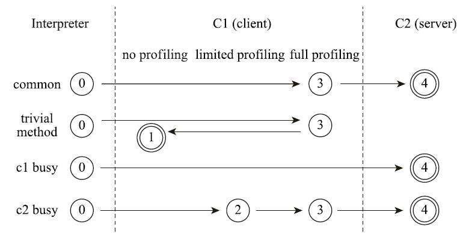
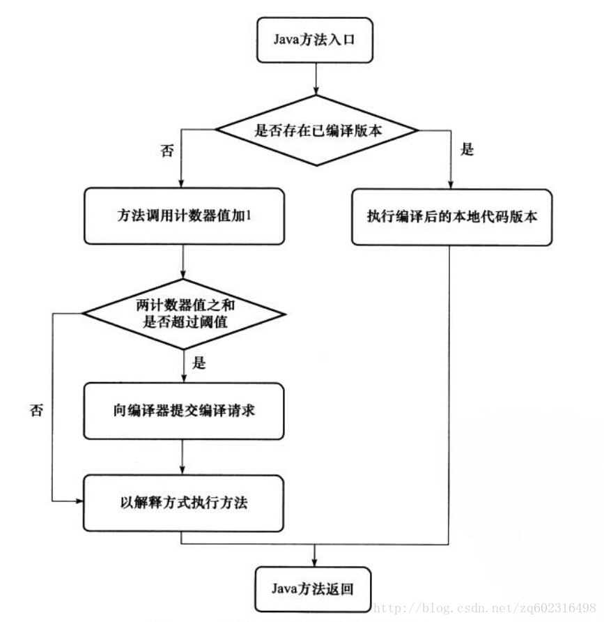
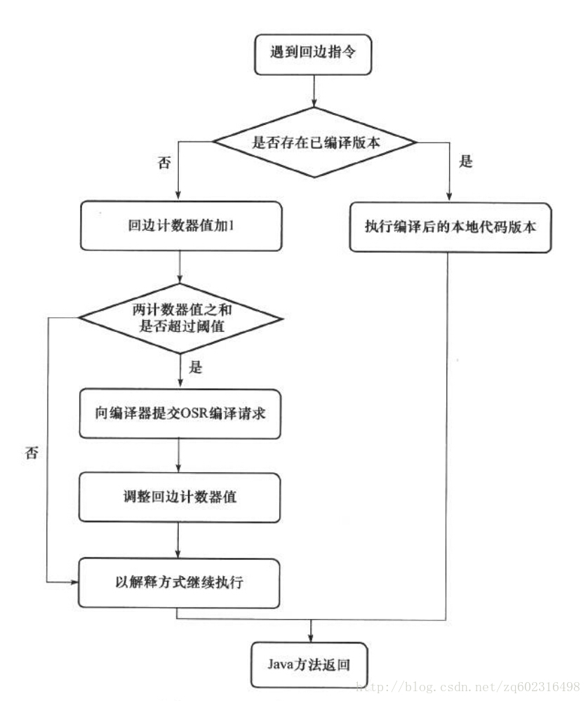
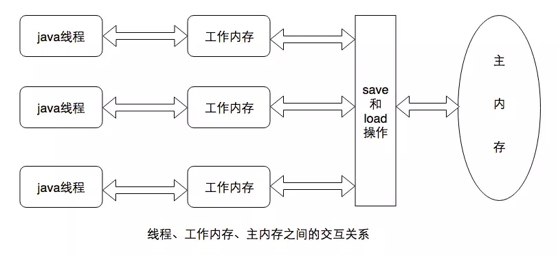
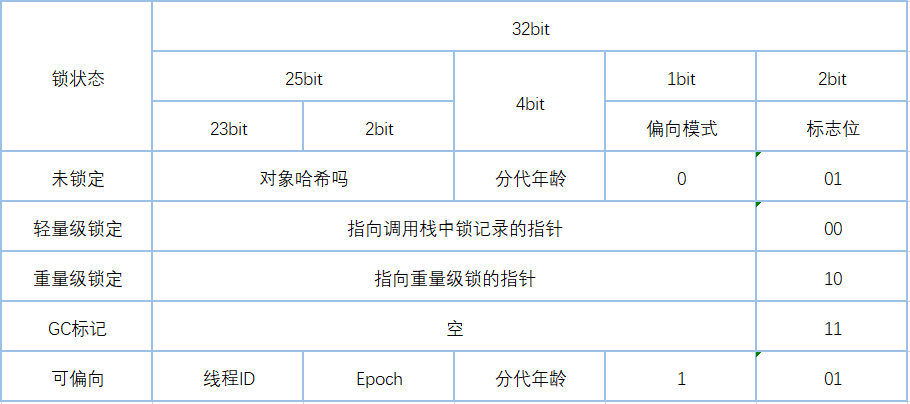

# Java 虚拟机摘要

> 参照周志明老师的《深入理解Java虚拟机》做的摘要

## Java 内存区域

### 运行时数据区域

 - **程序计数器：**当前线程所执行的字节码的行号指示器
 - **Java 虚拟机栈：**线程私有。每个方法被执行的时候，Java 虚拟机会同步创建一个栈帧用于存储局部变量表、操作数栈、动态连接、方法出口等信息。方法的从调用到执行完毕对应一个栈帧在虚拟机栈中从入栈到出栈的过程。

 - **Java 堆：**线程共享。对象和数组实例都是在这分配内存，是 GC 重点照顾的对象。以前很多虚拟机的垃圾收集器是基于分代收集理论设计的，所以也经常分为新生代、老年代、Eden 空间、From Survivor 空间、To Survivor 空间等。现在很多垃圾收集器设计理念已经发生了变化，所以以后基于分代思维可能需要改变了。

 - **方法区：**线程共享。用于存储已被虚拟机加载的类型信息、常量、静态变量、即时编译器编译后的代码缓存等数据。

 - **运行时常量池：**方法区的一部分、存放编译器生产的各种字面量和符号引用，也能在运行期将新的常量放入池中。

java 运行时数据区 

   

 - **对象创建：**

	1. 分配内存
	2. 执行构造函数和 <init> 方法将对象初始化
	3. 将内存地址指向引用的指针；   

 - **对象内存布局：**
	1. 对象头：GC 分代年龄、哈希吗、锁状态标志、线程持有的锁、偏向线程 ID、偏向时间戳。
	2. 实例数据
	3. 对齐填充

## 垃圾收集器与内存分配

### 判断对象是否存活（标记垃圾）

1. **引用计数算法：**虚拟机为每一个对象加一个引用计数器，当有一个地方引用该对象时，计数器加一；当引用失效时，计数器减一。  
引用计数算法虽然占用了一些额外内存空间来计数，但它的原理简单，判断效率也很高，在大多数情况下都是一个不错的算法。  
**缺点：**必须要配合大量额外处理才能保证正确工作，而且对于对象之间相互循环引用也很难解决。

2. **可达性分析算法：**通过一系列“GC Roots”的根对象作为起始节点集，从这些节点开始根据引用关系向下搜索，搜索过程所走过的路径称为“引用链”，如果某个对象到 GC Roots 间没有任何引用链相连，则证明此对象不可达，可进行垃圾标志等待回收。

固定可作为 GC Roots 的对象包括以下几种：

 - 在虚拟机栈（栈帧中的本地变量表）中引用的对象，譬如各个线程被调用的方法堆栈中使用到的参数、局部变量、临时变量等。
 - 在方法区中类静态属性引用的对象，譬如 Java 类的引用类型静态变量；
 - 在方法区中常量引用的对象，如字符串常量池里的引用；
 - 在本地方法栈中 JNI（即常所说的 Native 方法）引用的对象。
 - Java 虚拟机内部的引用，如基本数据类型对应的 Class 对象，一些常驻的异常对象 (比如 NullPointExcepiton)等，还有系统类加载器；
 - 所有同步锁持有的对象；
 - 反映 Java 虚拟机内部情况的 JMXBean、JVMTI 中注册的回调、本地代码缓存等

### 垃圾收集算法：

 - **标记-清除算法：**首先标记出所有需要回收的对象，在标记完成后，统一回收掉所有被标记的对象，也可以反过来，标记存活的对象，统一回收所有未被标记的对象;  
   **缺点：**一个是执行效率不稳定， 如果 Java 堆中包含大量对象，而且其中大部分是需要被回收的，这时必须进行大量标记和清除的动作，导致标记和清除两个过程的执行效率都随对象数量增长而降低；第二个是内存空间的碎片化问题，标记、清除之后会产生大量不连续的内存碎片，空间碎片太多可能会导致当以后在程序运行过程中需要分配较大对象时，无法找到足够的连续内存而不得不提前触发另一次垃圾收集动作；
 - **标记-复制算法：**将内存区域按比例划分为不同的区域，当一块内存用完了，就进行 GC 然后把存活的对象复制到另一块上面，然后再把已使用过的内存空间一次清理掉，这样能有效避免内存空间碎片的问题。  
   **缺点：**可用内存变小，无法完全利用内存造成空间浪费。
   主流商用 Java 虚拟机用于新生代的收集算法，因为新生代中的对象有 98% 熬不过第一轮收集，所以需要复制的对象不多。同时 Eden 和 Survivor 的比例是8：1，浪费的内存空间相对较少。
 - **标记-整理算法：** 标记清除后让所有存活的对象都向内存空间一端移动，然后直接清理掉边界以外的内存。相比标记清除算法，解决了内存空间碎片的问题，但相对的引入了整理的过程，提升了复杂度和性能花销。
   **缺点：**如果每次回收后存活的对象都很多，就会给系统带来极大的负重操作。

根节点枚举：所有收集器在这一步骤都必须暂停用户线程

安全点：收到“Stop The World”后，用户程序需要到达安全点才能暂停，不能随意暂停；

并发的可达性分析：

 - 增量更新：把新插入的引用记录下来，扫描结束后针对新插入的重新扫描一次；
 - 原始快照：将要删除的引用对象记录下来，扫描结束后以这些对象作为根再扫描一遍；

垃圾收集器：

 - Serial：新生代收集器，标记-复制，会暂停其它所有线程，简单高效；
 - ParNew: Serial 的多线程版本，可与 CMS 收集器配合工作；
 - Parallel Scavenge:新生代收集器，跟 ParNew 非常相似，但是更在意吞吐量；
 - Serial Old：老年代收集器，标记-整理，会暂停其它所有线程，简单高效，更多的是客户端模式下使用
 - Parallel Old：老年代收集器，标记-整理，多线程并发收集;
 - CMS： 老年代收集器，以获取最短回收停顿时间为目标，常跟 ParNew 配合使用，从JDK 9开始不推荐，推荐 G1 取代。
 - Garbage First(G1):面向服务端的垃圾收集器，不再坚持固定大小以及固定数量的分代区域划分，而是把连续的 Java 堆划分为多个大小相等的独立区域（Region），每一个 Region 都可以根据需要，扮演新生代的 Eden 空间或 Survivor 空间或老年代空间，还会为大对象划分专属的 Humongous 区域。允许用户选择期望的停顿时间

G1运作过程：

- 初始标记：标记 GC Roots 能直接关联的对象，需要停顿所有线程，但耗时很短；
- 并发标记：从 GC Roots 开始对对象进行可达性分析，耗时较长，但可与用户程序并发执行；
- 最终标记：通过原始快照算法处理并发阶段遗留的记录；
- 帅选标记：更新 Region 的统计数据，对各个 Region 的回收价值和成本进行排序，根据用户所期望的最短时间来制定回收计划。将选择的回收 Region 中的存活对象复制到空 Region 中，然后清理掉整个旧的 Region 的全部空间。

低延迟垃圾收集器：

 - Shenandoah：RedHat 公司开发的低延迟收集器
 - ZGC：尚在实验中的低延迟垃圾收集器，由 Oracle 公司研发。使用了染色指针的新技术。

## 虚拟机类加载机制

一个类型的生命周期有加载、连接（验证、准备、解析）、初始化、使用、卸载。其中加载、验证、准备、初始化和卸载这五个阶段的开始顺序是确定的，而解析则不一定，因为有些符号引用需要运行时才能确定调用者类型然后进行解析。

> 注意：是开始顺序确定，结束顺序则不一定，比如类加载还没结束就会开始验证

Java虚拟机规范规定了**有且只有六种情况**在类没有初始化时必须对类进行初始化（加载、验证、准备自然需要在此之前开始）：

1. 遇到 new、getstatic、putstatic、invokestatic 这四条字节码指令时，也就是实例化对象、读取或设置一个静态字段（被 final 修饰、已在编译器把结果放入常量池的静态字段除外）、调用一个类型的静态方法的时候；（使用静态字段或者方法的时候，只会初始化定义静态字段或方法的类，比如通过子类调用父类的静态字段，只会初始化父类）
2. 使用 java.lang.reflect 包的方法对类型进行反射调用的时候；
3. 当初始化类时，父类没有初始化的时候需要对父类进行初始化；
4. 虚拟机启动时，用户需要指定一个要执行的类（包含 main 方法的类），虚拟机会先初始化这个类；
5. 使用 java.lang.invoke.MethodHandle 实例解析方法句柄的时候；
6. 定义了默认方法（被 default 关键字修饰的方法）的接口，如果这个接口的实例初始化，该接口也要在此之前被初始化；

### 类加载的过程

**加载：**

1. 通过一个类的全限定名来获取定义此类的二进制字节流（没有规定从哪里获取字节流，所以可以是文件，也可以是网络，动态加载的基础支持）；
2. 将这个字节流所代表的静态存储结构转化为方法区的运行时数据结构；
3. 在内存中生成一个代表该类的 java.lang.Class 对象，作为方法区这个类的各种数据访问入口；

加载阶段结束后，Java虚拟机外部的二进制字节流就按照虚拟机所设定的格式存储在方法区中了。

**验证：**

1. **文件格式验证：**验证字节流是否符合 Class 文件格式的规范，并且能被当前版本的虚拟机处理。只有保证输入的字节流能够正确地解析并存储于方法区之内，这个段字节流才被允许进入Java虚拟机内存的方法区中进行存储。所以这个阶段会于加载过程中就开始。
2. **元数据验证：**对字节码描述的信息（即类的元数据信息）进行语义分析，以保证其描述的信息符合 Java 语义规范的要求；
3. **字节码验证：**对类的方法体进行校验分析，包括数据流分析和控制流分析等复杂流程，保证被校验类的方法在运行时不会做出危害虚拟机安全的行为，是验证过程中最复杂的阶段；
4. **符号引用验证：**通过对符号引用校验，检测是否存在对应的类、方法或字段，以及对该类、方法或字段是否具有访问权限。该验证发生在解析阶段，目的是确保解析行为能正常执行；

**准备：**

准备阶段是正式为类中定义的变量（即静态变量）分配内存并设置变量初始值，用户设置的值需要在初始化阶段才会设置。

**解析：**

解析阶段是Java虚拟机将常量池内的符号引用替换为直接引用的过程，直接引用是可以直接指向目标的指针、相对偏移量或者是一个能间接定位到目标的句柄。解析动作主要针对类或接口、字段、类方法、接口方法、方法类型、方法句柄和调用限定符7类符号引用进行。

**初始化：**

初始化阶段就是执行类构造器<clinit>() 方法的过程，该方法是由编译器自动收集类中所有类变量（静态变量）的赋值动作和静态语句块中的语句合并产生的；静态语句是按顺序收集的，所以只能访问到定义在静态语句块之前的变量。父类方法的初始化先于子类方法的初始化。

### 类加载器

“通过一个类的全限定名来获取定义此类的二进制字节流”这个动作就是通过类加载器实现的（通过loadClass 方法）。同一个类比较是否相等必须在同一个类加载器加载，否则无意义。

**三层类加载器**

1. **启动类加载器：**Bootstrap Class Loader。使用 C++ 语言实现，无法被 Java 程序直接引用，负责加载存放<JAVA_HOME>\lib目录，如果需要把加载器请求委派给启动类加载器，那直接使用 null 代替即可。
2. **扩展类加载器：**Extension Class Loader（ExtClassLoader）。java 实现，开发者可以直接在程序中使用，负责加载<JAVA_HOME>\lib\ext目录中，或者被 java.ext.dirs 系统变量所指定的路径中所有的类库。
3. **应用程序类加载器：**Application Class Loader（AppClassLoader）。负责加载用户类路径上所有的类库，开发者可以直接在程序中使用，如果应用程序中没有定义过自己的类加载器，一般情况下这个就是程序中的默认类加载器。

双亲委派模式要求除了顶层的启动类加载器外，其余的类加载器都应有自己的父类加载器。

**双亲委派模式**

双亲委派模式工作过程：如果一个类加载器收到了类加载的请求，它首先不会自己去尝试加载这个类，而是把这个请求委派给父类加载器去完成，每一个层次的类加载器都是如此，因此所有的加载请求都应该传送到最顶层的启动类加载器中，只有当父加载器反馈自己无法完成这个加载请求（搜索范围内没有找到该类）时，子加载器才会尝试自己去完成加载。

类加载器双亲委派模型 

   

## 虚拟机字节码执行引擎

### 运行时栈帧结构

栈帧是用于支持虚拟机进行方法调用和方法执行背后的数据接口，它也是虚拟机运行时数据区中的虚拟机栈的栈元素。栈帧存储了方法的局部变量表、操作数栈、动态连接和方法返回地址等信息。方法的从调用到执行完毕对应一个栈帧在虚拟机栈中从入栈到出栈的过程。在编译 Java 程序源码的时候，栈帧需要多大的局部变量表，需要多深的操作数栈就已经被分析计算出来，并写入到方法表（每个类都有一个方法表记录定义的方法）的 Code 属性之中，即栈帧需要的内存在编译时已经确定了的。

#### 局部变量表

局部变量表是一组变量值的存储空间，用于存放方法参数和方法内部定义的局部变量。如果执行的是实例方法，那局部变量表中第0位索引的变量槽默认是用于传递方法所属对象实例的引用。

#### 操作数栈

后入先出的栈，方法执行中参数的调用和运算都要依赖于操作数栈。

#### 动态连接

每个栈帧都包含一个指向运行时常量池中该栈帧所属方法的引用，只有这个引用是为了支持方法调用过程中的动态连接。

#### 方法返回地址

方法退出会将栈帧出栈，恢复上层方法的局部变量表和操作数栈，把返回值（有的话）压入调用者栈帧的操作数栈中，调整 PC 计数器的值以指向方法调用指令后面的一条指令。

### 方法调用

一切方法在 class 文件里面存储的都只是符号引用，而不是方法在实际运行时内存布局中的入口地址。

#### 解析

在类加载解析阶段，会将其中一部分的符号引用转化为直接引用，这一类解析前提是方法在程序运行前就有一个可确定的调用版本，并且这个版本在运行期不会改变。

#### 分派

有些方法的符号引用在解析阶段并不能确定它的直接引用，所以会在运行时进行分派，通常是虚方法才需要分派，即除静态方法、私有方法、实例构造器、父类方法和 final 修饰的方法之外的方法。

### 基于栈的字节码解释执行引擎

javac 编译器完成了程序代码经过词法分析、语法分析到抽象语法树，再遍历抽象语法树生成线性的字节码指令流的过程

#### 解释执行

动态产生每条字节码对应的汇编代码来运行。

#### 基于栈的解释执行

Javac 编译器输出的字节码指令流，基本上是一种基于栈的指令集架构，字节码指令流里面的指令大部分都是零地址指令，它们依赖操作数栈进行工作

## 前端编译与优化

前端编译器：JDK 的 Javac  
即时编译器：HotSpot 虚拟机的 C1、C2 即时编译器，Graal 编译器  
提前编译器：JDK 的 Jaotc

前端编译器做的优化措施更多是为了降低程序员的编码复杂度、提高编码效率；后端编译器则是对程序执行性能进行优化。

### Javac 编译器

Javac编译过程：

1. 准备过程：初始化插入式注解处理器；
2. 解析与填充符号表过程，包括：  
 
 - 词法、语法分析。将源代码的字符流转变为标记集合，构造出抽象语法树。
 - 填充符号表。产生符地址和符号信息。

3. 插入式注解处理器的注解处理过程：插入式注解处理器的执行阶段，如果产生新的符号就需要回到之前的过程2重新处理。
4. 分析与字节码生成过程。包括：
 
 - 标注检查。对语法的静态信息进行检查。
 - 数据流及控制流分析。对程序动态执行过程进行检查。
 - 解语法糖。将简化代码编写的语法糖还原为原有的形式。
 - 字节码生成过程。将前面各个步骤所生成的信息转化为字节码。

### Java 语法糖

1. 泛型：只在源码中存在，经过编译后的字节码中，全部泛型都被替换为原来的裸类型，并且在相应的地方插入了强制转换代码，即会类型檫除。
2. 自动装箱、拆箱：对基本数据类型转化为对应的包装类型，或者相反操作。
3. 遍历循环：将 for-each 替换为迭代器遍历
4. 条件编译器：根据布尔常量值的真假将分支中不成立的代码块消除掉。

## 后端编译与优化

后端编译：将 Class 文件转换成与本地基础设施（硬件指令集、操作系统）相关的二进制机器码。

### 即时编译器

即时编译器：当虚拟机发现某个方法或代码块运行特别频繁，就会把这些代码认定为“热点代码”，为了提高热点代码的执行效率，在运行时，虚拟机将会把这些代码编译成本地机器码，并以各种手段进行代码优化，运行时完成这个任务的后端编译器被称为即时编译器。

解释器：当程序需要迅速启动和执行的时候，解释器可以首先发挥作用，省去编译的时间，立即运行。同时在运行时收集程序性能监控信息，为即时编译器的优化提供数据参考，解释器还作为即时编译器激进优化时的后备逃生门（去优化）。

HotSpot 虚拟机内置了两个编译器（或三个，Graal 仍处于实验中），分别被称为“客户端编译器” - C1 编译器和“服务端编译器” - C2 编译器。

通常优化程度越高的代码，所需的编译时间便会越长，解释器收集的信息要求也更全，这会对程序的执行性能有一定的干扰，所以 Hotspot 虚拟机采用了分层编译的功能：

 - 第0层。程序纯解释执行，并且解释器不开启性能监控功能。
 - 第 1 层。使用客户端编译器将字节码编译为本地代码来运行，进行简单可靠的稳定优化，不开启性能监控功能。
 - 第 2 层。仍然使用客户端编译器执行，仅开启方法及回边次数统计等有限性能监控功能。
 - 第 3 层。仍然使用客户端编译器执行，开启全部性能监控功能，除了第 2 层的统计信息外，还会收集如分支跳转、虚方法调用版本等全部统计信息。
 - 第 4 层。使用服务端编译器将字节码编译为本地代码，相比起客户端编译器，服务端编译器会启用更多编译耗时更长的优化，还会根据性能监控信息进行一些不可靠的激进优化。

分层编译的交互关系 

   

热点代码主要有两类：

1. 被多次调用的方法。
2. 被多次执行的循环体

对于这两种情况，编译的目标对象都是整个方法体，这也是虚拟机中标准的即时编译方式。第一种是直接以整个方法作为编译对象；第二种是在第一种的基础上传入执行入口点字节码序号（从第几条字节码指令开始执行编译），这种编译因为发生在方法执行的过程中，被称为栈上替换，即方法的栈帧还在栈上，方法就被替换了。

判断某段代码是不是热点代码是通过“热点探测”来进行的，主流热点探测方式有以下两种：

1. 基于采样的热点探测。即周期的检测各个线程的调用栈顶，如果发现某个方法经常出现在栈顶，就判断为热点方法。这种实现方式简单高效，还可以很容易的获取方法的调用关系（将调用栈顶展开即可），缺点是很难精确的确认一个方法的热度，容易受到线程阻塞或者别的外界因素干扰。
2. 基于计数器的热点探测。虚拟机为每个方法（或者是回边代码块-统计回边次数）建立计数器，统计方法的执行次数，执行次数超过一定阈值就认为是热点方法。这种方式虽然实现复杂点，还要为每个方法建立并维护计数器，而且不能直接获取方法的调用关系，但它的统计结果相对来说更加严谨。

方法调用计数器触发即时编译 

   

回边计数器触发即时编译 

   

### 提前编译器

1. 在程序运行之前把程序代码直接编译成机器码。
2. 把原本即时编译器在运行时要做的编译工作提前做好并保存下来，下次运行到这些代码（譬如公共代码在被同一台机器其它 Java 进程使用）时直接把它加载进来使用。

提前编译能将编译过程中最耗时的优化措施如“过程间分析”等以及一些其它耗时的优化措施提前进行，避免运行时对用户程序的干扰。

即时编译器要占用程序运行时间和运算资源，而且达到全速运行状态需要一定的时间。但是由于运行时数据监控的功能，能够进行热点代码分析并制定合适的优化方案，而且一些激进预测性优化也无法脱离运行时的数据参考。

### 编译器优化技术

#### 方法内联

将目标方法的代码原封不动地“复制”到发起调用的方法之中，避免发生真实的方法调用。方法内联能够去除方法调用的成本（查找方法版本、建立栈帧等），为其它优化建立良好的基础，多数其他优化都是基于方法内联的基础上的。

#### 逃逸分析

分析对象动态作用域，当一个对象在方法里面被定义后，它可能被外部方法引用，例如作为参数传递到其它方法中，这种称为方法逃逸；甚至还可能被外部线程访问到，譬如赋值给可以在其他线程中访问的实例变量，这种称为线程逃逸；从不逃逸、方法逃逸到线程逃逸，称为对象由低到高的不同逃逸程度。

针对不逃逸或者逃逸程度低的对象实例，可采取一下优化措施：

 - **栈上分配：**由于垃圾回收需要消耗大量资源，如果确定一个对象不会逃逸出线程之外，那让这个对象在栈上分配内存将会是一个不错的主意，对象所占用的内存空间就可以随栈帧出栈而销毁。支持方法逃逸不支持线程逃逸。
 - **标量替换：**若一个数据无法再分解成更小的数据来表示，如基本的数据类型，那它就可以称为标量。如果把一个 Java 对象拆散，根据程序访问的情况，将其用到的成员变量恢复为原始类型直接在方法中定义来访问，这个过程称为标量替换。由于去掉对象实例的创建，所以需要对象完全不逃逸。
 - **同步消除：**由于线程同步本身是一个相对耗时的过程，如果逃逸分析能够确定一个变量不会逃逸出线程，无法被其他线程访问，那么这个实例对象的读写就不会有竞争，因此针对这个对象的同步措施就可以安全的消除掉。

#### 公共子表达式消除

如果一个表达式 E 之前已经被计算过了，并且从之前的计算到现在 E 中所有变量的值都没有发生变化，那么 E 的这次出现就称为公共子表达式。对于这种公共子表达式，就没必要花时间重新对其进行计算，只需要直接使用前面计算过的表达式结果代替 E。

#### 数组边界检查消除

对于虚拟机的执行子系统来说，每次数组元素的读写都带有一次隐含的条件判断操作，当数组越界时抛出一个运行时异常以避免溢出攻击（像 C 语言数组越界会产生不可控的结果），但对于含有大量数组访问操作的程序代码，这必定是一种性能负担。如果编译器能够通过数据流分析能够确定数组的访问不会越界，如循环读取数组数据时，那么编译器就会把数组的上下界检查消除掉，这可以节省很多次的条件判断操作。

## Java 内存模型与线程

### Java 内存模型

#### 主内存与工作内存

Java 内存模型的主要目的是定义程序中各种变量的访问规则，即关注在虚拟机中把变量值存储到内存和从内存中取出变量值的细节。此处的变量包括实例字段、静态字段和构成数组的对象的元素，但不包括局部变量与方法参数，因为后者是线程私有的，不会被共享。

Java 内存模型规定了所有变量都存储在主内存中，每条线程还有自己的工作内存，线程的工作中保存了被该线程使用的变量的主内存副本。线程对变量的所有操作（读取、赋值等）都必须在工作内存中进行，而不能直接读写主内存中的数据。不同线程之前也无法访问对方的工作内存中的变量，线程间变量值的传递需要通过主内存来完成。

线程、工作内存、主内存之间的交互关系如图 

   

#### 内存间交互操作

关于主内存与工作内存之前具体的交互协议，即一个变量如何从主内存拷贝到工作内存、如何从工作内存同步回主内存这一类细节，Java 内存模型定义了 8 种操作，每一种都是原子的，不可再分的。

1. lock（锁定）：作用于主内存的变量，它把一个变量识别为一条线程独占的状态。
2. unlock（解锁）：作用于主内存的变量,它把-个处于锁定状态的变量释放出来，释放后的变量才可以被其他线程锁定。
3. read（读取）：作用于主内存的变量，他把一个变量的值从主内存传输到线程的工作内存中，以便随后的 load 动作使用。
4. load（载入）：作用于工作内存的变量，他把 read 操作从主内存中得到的变量值放入工作内存的变量副本中。
5. use（使用）：作用于工作内存的变量，它把工作内存中一个变量的值传递给执行引擎. 每当虚拟机遇到一个需要使用变量的值的字节码指令时将会执行这个动作。
6. assign（赋值）：作用于工作内存的变量，他把一个从执行引擎接收的值赋给工作内存的变量，每当虚拟机遇到一个给变量赋值的字节码指令时执行这个操作。
7. store（存储）：作用于工作内存的变量，它把工作内存中一个变量的值传送到主内存中，以便随后的 write 操作使用。
8. write（写入）：作用于主内存的变量，他把 store 操作从工作内存中得到的变量的值放入主内存的变量中。

对于这 8 种操作，虚拟机也规定了一系列规则，在执行这 8 种操作的时候必须遵循如下的规则：

 - 不允许 read 和 load、store 和 write 操作之一单独出现，也就是不允许从主内存读取了变量的值但是工作内存不接收的情况，或者不允许从工作内存将变量的值回写到主内存但是主内存不接收的情况。
 - 不允许一个线程丢弃最近的 assign 操作，也就是不允许线程在自己的工作线程中修改了变量的值却不同步/回写到主内存。
 - 不允许一个线程回写没有修改的变量到主内存，也就是如果线程工作内存中变量没有发生过任何assign操作，是不允许将该变量的值回写到主内存变量只能在主内存中产生。
 - 不允许在工作内存中直接使用一个未被初始化的变量，也就是没有执行 load 或者 assign 操作。也就是说在执行 use、store 之前必须对相同的变量执行了 load、assign 操作。
 - 一个变量在同一时刻只能被一个线程对其进行 lock 操作，也就是说一个线程一旦对一个变量加锁后，在该线程没有释放掉锁之前，其他线程是不能对其加锁的，但是同一个线程对一个变量加锁后，可以继续加锁，同时在释放锁的时候释放锁次数必须和加锁次数相同。
 - 对变量执行 lock 操作，就会清空工作空间该变量的值，执行引擎使用这个变量之前，需要重新 load 或者 assign 操作初始化变量的值。
 - 不允许对没有lock的变量执行unlock操作，如果一个变量没有被 lock 操作，那也不能对其执行unlock操作，当然一个线程也不能对被其他线程 lock 的变量执行 unlock 操作。
 - 对一个变量执行 unlock 之前，必须先把变量同步回主内存中，也就是执行 store 和 write 操作。

当然，最重要的还是如开始所说，这8个动作必须是原子的，不可分割的。

#### Volatile

volatile 可以说是 Java 虚拟机提供的最轻量的同步机制，它修饰得变量具有两项特性：

1. 保证此变量对所有线程的可见性，一个线程修改了这个变量的值，新值对于其他线程来说可以立即得知，即修改变量后需要同步到主内存，同时使用的时候也需要从主内存刷新变量的值。
2. 禁止指令重排序。由于虚拟机会在保证运算结果跟代码顺序执行的结果一致的情况向进行指令重排序优化。volatile 修饰的变量会要求不被指令重排序优化，保证代码执行顺序跟程序的顺序相同。

volatile 缺点是无法保证原子性，这导致 volatile 变量的运算在并发下一样是不安全的。比如自增运算，将变量取到操作数栈时，会跟主内存同步，保证变量的正确性，但是当执行加一指令时，其他线程可能已经把变量的值改变了，而操作数栈顶的值就变成了过期的数据，执行加一后就可能把不正确的值同步回主内存。

volatile 变量适合以下两条规则的运算场景：

 - 运算结果并不依赖变量的当前值，或者能够确保只有
 - 
 - 单一线程修改变量的值。
 - 变量不需要与其他的状态变量共同参与不变约束。

#### 原子性、可见性与有序性

##### 原子性

原子性即操作无法被分解，执行开始到结束不会插入其它指令。基本数据类型的访问、读写都具备原子性。如果要保证大范围的原子性，需要依赖同步操作。

##### 可见性

可见性就是指当一个线程修改了共享变量的值时，其它线程能够立刻得知这个变量的修改。volatile、synchronize 和 final 都能实现可见性。

##### 有序性

如果在本线程内观察，所有操作都是有序的；如果在一个线程中观察另一个线程，所有的操作都是无序的。volatile 和 synchronize 能够保证线程的有序性。

#### 先行发生规则（Happens-Before）

先行发生原则是 Java 内存模型中定义的两个操作之间的偏序关系。比如说操作 A 先行发生于操作B，那么在 B 操作发生之前，A 操作产生的“影响”都会被操作 B 感知到。这里的影响是指修改了内存中的共享变量、发送了消息、调用了方法等。它是判断数据是否存在竞争，线程是否安全的非常有用的手段。

**Java内存模型自带先行发生原则有哪些**

 - **程序次序原则：**在一个线程内部，按照代码的顺序，书写在前面的先行发生于后边的。或者更准确的说是在控制流顺序前面的先行发生于控制流后面的，而不是代码顺序，因为会有分支、跳转、循环等。
 - **管程锁定规则：**一个 unlock 操作先行发生于后面对同一个锁的lock操作。这里必须注意的是对同一个锁，后面是指时间上的后面
 - **volatile变量规则：**对一个 volatile 变量的写操作先行发生于后面对这个变量的读操作，这里的后面是指时间上的先后顺序
 - **线程启动规则：**Thread对象的 start() 方法先行发生于该线程的每个动作。当然如果你错误的使用了线程，创建线程后没有执行 start 方法，而是执行 run 方法，那此句话是不成立的，但是如果这样其实也不是线程了
 - **线程终止规则：**线程中的所有操作都先行发生于对此线程的终止检测，可以通过 Thread.join()和 Thread.isAlive() 的返回值等手段检测线程是否已经终止执行
 - **线程中断规则：**对线程 interrupt() 方法的调用先行发生于被中断线程的代码检测到中断事件的发生，可以通过 Thread.interrupted() 方法检测到是否有中断发生。
 - **对象终结规则：**一个对象的初始化完成先行发生于他的 finalize 方法的执行，也就是初始化方法先行发生于 finalize 方法
 - **传递性：**如果操作 A 先行发生于操作 B，操作 B 先行发生于操作 C，那么操作 A 先行发生于操作 C。

### Java 线程

Java 线程是与内核线程 1:1 对应的，所有各个线程的操作如创建、析构和同步，都需要进行系统调用，而系统调用需要在用户态和内核态中来回切换，花销较大。

Java 线程的状态：

 - 新建（New）
 - 运行（Runnable）
 - 无限期等待（Waiting）
 - 限期等待（Timed Waiting）
 - 阻塞（Blocked）
 - 结束（Terminated）

## 线程安全与锁优化

### 线程安全

线程安全：当多个线程同时访问一个对象时，如果不用考虑这些线程在运行时环境下的调度和交替执行，也不需要进行额外的同步，或者在调用方进行其他额外的协调操作，调用这个对象的行为都可以获得正确的结果，那就称这个对象是线程安全的。

Java中各种操作共享的数据按线程安全的由强到弱分为以下五类：不可变、绝对线程安全、相对线程安全、线程兼容和线程对立。

#### 线程安全的实现方法

##### 1. 互斥同步（阻塞同步）

同步是指在多个线程并发访问共享数据时，保证共享数据在同一时刻只被一条（或者是一些，当使用信号量的时候）线程使用。

**Synchronize** 是最基本的互斥同步手段，Javac 编译后由会在同步块的前后形成 monitorenter 和 monitorexit 两个字节指令，这两个字节码指令都需要一个 reference 类型的参数来指明要锁定和解锁的对象。

在执行 monitorenter 指令时，会先尝试获取对象的锁，对象没有锁或者当前线程已经持有这个对象锁，就把锁的计数器的值加一，执行 monitorexit 指令时会将计数减一。当计数器的值为零，锁随即就被释放了。如果锁被其他线程持有，当前线程就会被阻塞直到锁被释放。

Synchronize 的使用需要注意：

 - 被 Synchronize 修饰的同步块对同一线程是可重入的，只是计数器的值加一或者减一而已，不会阻塞自己。
 - 被 Synchronize 修饰的同步块在持有锁的线程执行完毕释放之前，会无条件阻塞其他线程的进入，同时获取锁的线程无法被强制释放锁，阻塞等待的线程也无法被强制中断等待或者超时退出。

Java 线程是映射到操作系统的原生内核线程之上的，如果阻塞或唤醒一条线程，需要操作系统来完成，这就不可避免地陷入用户态到核心态的转换中，进行这种状态转换需要耗费很多的处理器时间。所以 Synchronize 在 Java 的一个重量级操作。

**重入锁（ReentrantLook）**是 Lock 接口的常见实现，相比 Synchronize 增加了一些高级功能：

 - 等待可中断：当持有锁的线程长时间不释放锁的时候，等待的线程可以选择放弃等待，改为处理其他事情。
 - 公平锁：多个线程在等待锁的时候，会按照申请锁的时间顺序来依次获取锁，即公平锁。Synchronize 中的锁是非公平的，ReentrantLook 默认也是非公平的，不过可以通过构造函数进行设置，公平锁容易导致 ReentrantLook 的性能急剧下降，会明显影响吞吐量。
 - 锁绑定多个条件： 一个 ReentrantLook 对象可以绑定多个 Condition 对象。

JDK 6之前，ReentrantLook 的性能是优于 Synchronize 的，不过随着 Synchronize 的锁优化，现在两种性能以及基本无差，而却 Java 虚拟机更容易针对 Synchronize 进行优化。

##### 2. 非阻塞同步

互斥同步属于一种悲观策略，总认为会存在数据竞争，需要进行加锁，这会导致用户态到核心态转换、维护锁计数器和检查是否有被阻塞的线程需要被唤醒等开销。

非阻塞同步是基于冲突检测的乐观并发策略，先进行数据操作，如果没有出现其他线程争用共享数据，那操作直接成功了；如果共享数据的确被争用，产生了冲突，再进行其他补救措施。

乐观并发策略需要硬件指令的支持，因为我们需要操作和冲突检测这两个步骤具备原子性，这类指令常用的有：

 - 测试并设置（Test-and-Set）
 - 获取并增加（Fetch-and-Increment）
 - 交换（Swap）
 - 比较并交换（Compare-and-Swap，即 CAS）
 - 加载链接/条件储存（Load-Linked / Store-Conditional，即 LL/SC）

上述指令的处理过程都是一个原子操作，执行期间不会被其他线程中断。

> 注意：CAS 无法确认变量被改了之后又被改回来的问题

##### 3. 无同步方案-线程本地存储

每一个线程 Thread 对象都有一个 ThreadLocalMap 对象，可以通过它把数据跟线程绑定，则线程之间的数据就不会存在竞争了。

### 锁优化

#### 自旋锁与自适应自旋锁

由于阻塞导致用户态到核心态的性能开销，和统计上发现在许多应用中共享数据的锁定状态只会持续很短的时间，为了不在这短暂的时间去阻塞和恢复线程，我们可以让本来需要阻塞的线程改为执行一个忙循环（自旋），以等待持有锁的线程处理完，这就是自旋锁。本质也是基于认为等待时间会很短，属于乐观策略的一种。

自旋锁的缺点是会占用处理器的时间，同时如果持有锁的线程迟迟不释放，就会造成自旋时间过长，白白消耗处理器资源。自旋锁默认自旋的次数是十次，超过次数就会走传统的阻塞方式挂起线程。

**自适应自旋锁**是对自旋锁的优化，自旋的时间不再固定，会根据性能监控信息以及上一次自旋等待是否成功获得锁等进行自旋时间的优化，会随着程序的运行进行自适应。

#### 锁消除

即时编译器会对不存在数据竞争的同步代码的锁进行消除。

#### 锁粗化

如果虚拟机探测到有一串零碎的操作都对同一个对象加锁，将会把锁同步的范围扩展到整个操作序列的外部，比如循环内提到循环外。

#### 轻量锁

轻量锁并不是用来代替重量级锁的，他设计的初衷是在没有多线程竞争的前提下，减少传统的重量级锁使用操作系统互斥量产生的性能消耗。

下表是 HotSpot 虚拟机对象头 MarkWord 

   

轻量级锁的工作过程：在代码即将进入同步块的时候，如果此对象没有被锁定（锁标志为“01”状态），虚拟机首先将在当前线程的栈帧中建立一个名为锁记录（Lock Record）的空间，用于存储锁对象目前的 Mark Word 的拷贝（官方称为 Displaced Mark Word），这时候线程堆栈与对象头的状态如图

下图是轻量级锁 CAS 操作之前堆栈与对象的状态 

   

然后，虚拟机将使用 CAS 操作尝试把对象的的 Mark Word 更新为指向 Lock Record 的指针。如果这个更新动作成功了，即代表改线程拥有了这个对象的锁，并且对象 Mark Word 的锁标志位将转变为“00”，表示此对象处于轻量级锁定状态。

下图是轻量级锁 CAS 操作之前堆栈与对象的状态 

   

如果这个更新操作失败了，就意味着至少存在一条线程与当前线程竞争获取该对象的锁。当出现两条线程以上争用同一个锁的情况，那轻量级锁就不在有效，必须要膨胀为重量级锁，锁标志的状态值变为“10”。

轻量级锁解锁过程也同样是通过 CAS 操作来进行的，如果对象的 Mark Word 仍然指向线程的锁记录，那就用 CAS 操作把对象当前的 Mark Word 和线程中复制的 Displaced Mark Word 替换回来。假如能够替换成功，那即解锁成功，如果替换失败，则说明有其他线程尝试过获取该锁，就要在释放锁的同时，唤醒被挂起的线程。

轻量级锁能够提升程序同步性能的依据是“对于绝大部分的锁，在整个同步周期内都是不存在竞争的”这一经验法则，也是一种乐观策略。如果没有竞争，通过 CAS 操作成功避免了互斥同步的开销，如果确实存在竞争，除了互斥同步本身开销外，还额外发生了 CAS 操作的开销，所以竞争频繁的时候开销比重量级锁还大。

#### 偏向锁

轻量级锁是在无竞争的情况下使用 CAS 操作去消除同步使用的互斥量，偏向锁是在无竞争的情况下把整个同步都消除掉，连 CAS 操作都不去做了。

当锁对象第一次被线程获取的时候，虚拟机将会把对象头中的标志位设置为“01”、把偏向模式设置为“1”，表示进入偏向模式。同时使用 CAS 操作把获取到这个锁的线程的 ID 记录在对象的 Mark Word 之中。如果 CAS 操作成功，持有偏向锁的线程以后每次进入这个锁相关的同步块时，虚拟机都可以不再进行任何同步操作（例如加锁、解锁及对 Mark Word 的更新操作等）。

一旦出现另外一个线程去尝试获取这个锁的情况，偏向模式就马上宣告结束。根据锁对象目前是否处于被锁定的状态决定是否撤销偏向（偏向模式设置为“0”），撤销后标志位恢复到未锁定（标志位位“01”）或轻量级锁定（标志位“00”）的状态，后续同步操作就按照上面介绍的轻量级锁那样去执行。

偏向锁、轻量级锁的状态转化即对象 Mark Word 的关系如下图： 

   

由于偏向锁在对象的 Mark Word 中存储线程 ID 的位置是用于存放哈希码的，所以一旦对象计算过哈希码后，就再也无法进入偏向锁状态了，同时如果对象处于偏向锁状态，当收到哈希码计算请求时，偏向状态会立即撤销，并且锁会膨胀为重量级锁。

偏向锁可以提高带有同步但无竞争的程序性能，并非总是对程序有利，如果程序中大多数的锁都总是被多个不同的线程访问，那偏向模式就是多余的。

偏向锁 -> 轻量级锁 -> 重量级锁

每一种同步模式都有它适合的场景，需要具体来分析，不能片面思考。

