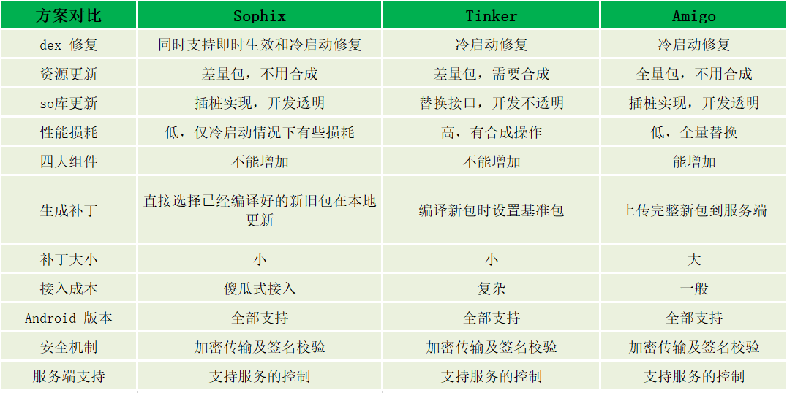

# 热修复摘要

> 参照《深入探索 Android 热修复技术原理》做的摘要。

热修复按生效类型一共分为两种：实时生效和重启应用生效。

每种类型按模块分为：Dex 文件修复、res 资源文件修复和 so 文件修复。

同时在虚拟机层面要考虑 Dalvik 虚拟机和 ART 虚拟机的实现区别

下图分别记录 Sophix、Tinker 和 Amigo 的实现原理，他们很多都是参考 Instant Run 的原理

## 实时生效（热替换）

实时生效只有 Sophix 支持，所以仅介绍 Sophix

### Dex文件修复 - 底层替换方案

**原理**：以 Art 虚拟机为例，每一个 Java 方法在 Art 虚拟机中都对应一个 ArtMethod, ArtMethod 记录了这个 Java 方法的所有信息，包括所属类、访问权限、代码执行地址（函数入口）等。 修复原理是直接在已经加载的类中的 native 层替换原有方法体。

**传统方法**：在 Java 层通过反射机制得到 Method 对象所对应的 jobject ，然后把旧方法的所有成员字段一一替换为新方法的成员字段。由于这种方法是根据公开的 Android 源码对方法结构体的成员字段一一替换，在代码层是写死的，一旦成员字段有出入，就会替换失败。而由于 Android 是开源的，很多厂商都会修改底层的方法体，导致有些机型无法进行热修复实时更新，兼容性不好。

**Sophix**：由于发现 ArtMethod 是紧密排列的，所以一个 ArtMethod 的大小，就是相邻两个 ArtMethod 的起始地址的差值。所以可以通过构建两个静态空方法在运行时通过计算它们的地址差值动态地获取 APP 所运行设备中的底层 ArtMethod 大小，然后对整个 ArtMethod 作为整体进行替换。因此可以忽略 ArtMethod 的结构差异，从而实现全版本的兼容。

**限制原理**  

由于该方案是在已经加载的类中直接替换原有方法，是在原有类的基础上进行修改的，因为无法实现对原有类的方法和字段进行增减，因为这样会破坏原有类的结构。

一旦补丁类中出现了方法个数的增加或减少，就会导致这个类及整个 Dex 的方法数发生变化。方法个数的变化伴随着方法索引的变化，这样在访问方法时就无法正确索引到正确的方法了。新增字段也一样，对于该类已经产生的实例，如果调用新方法访问了新字段就会发生诡异的错误。

不过新增一个完整的、原有包不存在的类是可以的，我的理解是新方法索引是新加的，不会对原有方法索引造成影响。

**访问权限的问题**：

- 方法调用时的权限检查
- 同包名下的权限检查，需要通过反射设置补丁类的 ClassLoader 为原来类的，这样访问同包名是判断为同一个 ClassLoader 就不会报错
- **反射调用非静态方法时**，由于反射的实例是原有类，反射取的方法是补丁的方法（已经替换），反射时会校验实例和方法是不是同属于一个类导致报非法参数错误，这个无法避免，只能通过冷启动方案修复。对于静态方法由于直接在类的级别进行调用，不需要接受实例，所以也没有相应的检查。

**编译器与语言特性的影响**：

- 非静态内部类和外部类相互访问私有的成员或方法，都会自动生成 access$** 相关方法（可以类比为 get 方法）提供访问，所以会造成方法数新增。解决办法是修改权限，如使用 protected 代替 private 。
- 由于匿名内部类系统会根据顺序分别命名为**外部类$数字**，所以如果新增或者减少一个匿名内部类，就会造成重新命名，在补丁工具中进行类的方法比对的时候就会提示有方法的新增，因为前后相同类名的匿名内部类都不是同一个匿名内部类，内部方法肯定会有差异。这个问题无解，相关修复只能通过冷启动。
- 不支持 < clinit > 方法，支持 < init > 方法， < clinit > 方法是编译器自动合成的，静态 field 的初始化和静态代码块会被编译在这个方法，类加载进行类初始化的时候会去调用 < clinit > 方法，仅调用一次。 < init > 方法对应的是非静态 field 和非静态代码块，在对象实例化的时候调用。所以热替换不支持静态 field 和静态代码块的修改，非静态则可以。
- final static 修饰的原始类型和 String类型，并不会被编译到 < clinit > 方法中，而是在类初始化执行 initSFields 方法是得到了初始化；如果修饰的是引用类型，初始化仍然在 < clinit > 方法中。所以 final static 修饰的原始类型和 String类型是可以修改的，而引用类型则不可以。
- 由于方法数只有简单的几行代码或者只被一个地方引用，在混淆的时候会被内联掉，如果对这个方法修改后导致重新混淆没有被内联，就会造成方法数的增加，这种只能走冷启动。
- 方法的参数没有使用的话混淆会进行裁剪，编译出来的是没有参数的方法，如果新修改的代码引用了参数，那混淆后还是有参的方法，跟线上的比就回检测为新增了方法。解决方案是对无引用的参数进行假装引用，具体看参数类型设计代码。
- 用 Lambda 也不能用热部署解决，具体原因看资料吧。
- 还有一些其它限制，就不一一列举了，总之热替换还是只适合修复一下比较简单的 Bug，复杂点的还是使用冷启动。 不过 Sophix 是可以两套方案结合使用的，应用未重启使用热替换，重启后走冷启动修复就 ok 了。

## 冷启动修复

### Dex文件修复

原理：

- Tinker : 
- Sophix： 补丁的粒度是类，

##### Dalvik虚拟机

**1.Sophix** 

生成补丁类 dex，然后在基线包 dex 中去掉补丁中的类，补丁包中要用到基线包的类会去基线包 dex 中查找，反之同理。基线包中的删除操作只是移除类定义的入口，对于类的具体内容不进行删除，这样可以最大限度减少修改。然后通过 Google 开源的 DexMerge 方案，把补丁 dex 和 原 dex 合并成一个完整的 dex 。使用 multi-dex 也可以在 Dalvik 虚拟机上支持多 dex。

**2.Tinker**

生成差量包 patch.dex 与应用的 classes.dex 合并成一个完整的 dex,完整的 dex 加载得到的 dexFile 对象作为参数构建一个 Element 对象，然后整体替换掉旧的 dex-Elements 数组。缺点是合成操作精细到方法差异，合成算法过于复杂而且是在 Java 层面操作的，所有对象都在 Java heap 上完成，有可能会造成 OOM。

**3.Amigo**

##### ART虚拟机

**1.Sophix** 

补丁的粒度是类，由于 ART 虚拟机默认已经支持多 dex 压缩文件的加载，所以把补丁 dex 命名为 classes.dex,原 APK 中的 dex 依次命名为 classes(2,3,4...).dex 就可以了，然后一起打包为一个压缩文件。再通过 DexFile.loadDex 得到 DexFile 对象，最后用该 DexFile 对象整体替换旧的 dexElement 数组就可以了。 

**2.Tinker**

同上 Dalvik 虚拟机

**冷启动修复的限制**

Application 是整个 APP 的入口，因此会在替换 dex 之前加载，此时加载的是原 dex。在加载补丁后，如果 Application 中引用到的其它新 dex 里的类，由于不在同一个 dex里，如果 Application 被打上了 pre-verified 标志，这时就会抛异常。

Tinker 的方案是在 AndroidManifest.xml 声明中就要求开发者将自己的 Application 替换涣成 TinkerApplicaTion。而对于眞正 App 的 Application ,要在初始化 TinkerApplicaTion 时作为参数传入。这样 TinkerApplicaTion 会接管这个传入的 Application ,在生命周期回调时通过反射的方式调用实际 Application 的相关回调逻辑。这么做确实很好地将入口 Application 和用户代码隔离开，不过需要改造原有的 Application ,如果对 Application 有更多扩展，接入成本也是比较高的。

Amigo 的方案是在编译过程中，用 Amigo 自定义的 gradle 插件将App的 Application 替换成了 Amigo 自己的另一个 Application，并且将原来的 Application 的 name 保存起来，该修复的问题都修复完再调用之前保存的 Application 的 attach(context) ,然后将它回调到 loadedApk 中，最后调用它的 onCreate() ,执行原有 Application 中的逻辑。这种方式只是在代码层面开发者无感知，但其实是在编译期间偷偷帮用户做了替换，有点掩耳盗铃的意思，并且这种对系统做反射也是有一定风险的。

Sophix 对 Application 的 pre-verified 标志进行清除，由于标志清除，Dalvik 虚拟机会在对这个类初始化时，同时加载这个类所有引用到的类。为解决这个问题需要把 Application 的逻辑挪到一个单独的逻辑类中，同时在 Application 中使用反射的方式调用逻辑类走 Application 的原有逻辑。

由于热修复需要调用相应的代码，这些代码在替换 dex 之前，所以是无法修复的，并且它们要存在 classes.dex 中。为了尽可能的减少替换前的类使用，需要第一时刻替换，所以替换的代码要放在 Application 的 attachBaseContext 中，注意此时权限还未授予，不能请求网络。

### res资源文件修复（resource.arsc文件）

目前市面上的很多资源热修复方案基本都是参照 Instant Run 的实现：

1. 构造一个新的 AssetManager，并通过反射调用 addAssetPath,把这个完整的新资源包加入到 AssetManager 中，这样就得到一个含有所有新资源的 AssetManager；
2. 找到所有引用 AssetManager 的地方，通过反射替换为新的 AssetManager；
3. 处理大量兼容性问题

Android 4.4 以上，addAssetPath 可以多次调用，但是重复的资源不会被解析，所以新的补丁文件里面的修复资源有些无法生效。而在Android 4.4 以上下，多次调用 addAssetPath 只有第一次会解析 resource.arsc 文件，所以要合成一个新的 AssetManager 替换。

其实 Java 层的 AssetManager 只是一个包装，真正的资源处理逻辑都是在 native 层的 AssetManager，解析后的资源包集合也是存放在 native 层的 mRecource 中。

Sophix 另辟蹊径，构造一个 package id 为 0x66 的资源包（默认的是 0x7f），这个包只包含了改变的资源项，直接在原有 AssetManager 中 addAssetPath 即可。这样既不需要全量更新资源包，也不需要更新补丁包来进行合成，同时不需要替换 AssetManager，省去很多兼容性问题。资源的改变包含三种增加、修改、删除三种情况：  
1. 增加资源，直接加入补丁包，新代码直接使用即可；
2. 删除资源，不使用即可，不影响其它；
3. 修改资源，比如替换图片，我们可以把它视为新增资源，只是在引用的代码上把 0x7f 的 id 改为新的 package id 为 0x66 开头的引用 id 即可。

对于新增资源导致的 ID 偏移，比如 id 从 0x7f020002 变为 0x7f020003 ，那么在比对代码的时候会把 0x7f020003 改为 0x7f020002，这样对于上线的 APP 相当于代码和资源都没有变化。

##### Dalvik虚拟机

**1.Sophix** 

通过调用 native 层的 destroy 方法，它会析构 native 层的 AssetManager，释放之前加载了的资源，然后把 Java 层的 AssetManager 对 native 层的 AssetManager 的引用设为空。然后就可以调用 Java 层 AssetManager 的 init() 方法，这个方法会在 native 层创建一个没有添加个任何资源且 mRecource 没有初始化的 AssetManager，再进行 addAssetPath，将原资源文件和补丁资源分布加进去，然后再走 mRecource 解析的逻辑，这样就不需要生产新的 AssetManager了。

**2.Tinker**

##### ART虚拟机

**1.Sophix** 

直接在原有 AssetManager 上应用补丁即可，并且由于用的是原来的 AssetManager，所以原先大量的反射修改替换操作就完全不需要了，大大提高加载补丁的效率。

**2.Tinker**

**2.Amigo**

下发完整的资源包

**遇到的问题：** WebView 的初始化触发了相关资源的注入，因而系统直接构造新的 ResourceImpl,替换掉了原先的 ResourceImpl，而加载过补丁资源的 AssetManager 由于是通过 ResourceImpl 进行引用的，也一起被这次替换弄丢了。由 createAssetManager 方法可知，资源地址是保存在 mSplitResDirs 中的，所以我们可以把补丁资源路径添加到 mSplitResDirs 列表中，这些在重新构建 AssetManager 时，系统会自动吧补丁资源加到新的 AssetManager 之中。

### so文件修复（由于要实时生效会有所限制，所以这只记录冷启动生效方案）

加载 so 文件是通过调用 System.loadLibrary() 方法传入文件名或者文件路径，然后该方法会走 native 层的 nativeLoad() 方法去加载相应的 so 文件。

##### 接口调用替换方案

使用自己的接口去替换 System 默认加载 so 库接口：

	SOPatchManager.loadLibrary() -> System.loadLibrary() 

SOPatchManager.loadLibrary() 加载 so 库的时候会优先尝试加载指定目录的补丁 so 文件，加载策略如下：

- 如果存在则加载补丁 so 库而不会去加载 APK 安装目录下的so库；
- 不过不存在补丁 so，那么调用 System.loadLibrary() 去加载安装目录下的so库。

##### 反射注入方案（Sophix 使用的方案）

native 层加载so库会走 findLibrary 方法通过 libraryName 查找对应的so库

当 Android SDK 小于23时，findLibrary 是通过遍历一个 File[] 类型的数组 nativeLibraryDirectories,所以我们只要把补丁so库的路径插入到 nativeLibraryDirectories 数组的最前面，就能够使得加载so库时加载的是补丁 so库，而不是原来的 so库，从而达到修复的目的（数组遍历是顺序的，查找到就不会继续往后了）。

当 Android SDK 大于23时，findLibrary 改为通过遍历一个 Element[] 类型的数组 nativeLibraryPathElements，所以我们只要把补丁so库的完整路径作为参数构建一个 Element 对象，然后插入到 nativeLibraryPathElements 数组的最前面，就能够使得加载so库时加载的是补丁 so库，而不是原来的 so库，从而达到修复的目的（数组遍历是顺序的，查找到就不会继续往后了）。

**优点：**

可以修复第三方库，同时接入方不需要像方案1一样强制侵入用户接口调用；

**缺点：**

需要不断的对 SDK 版本进行适配，因为 findLibrary 可能会随着 SDK 版本变化而变化。

##### Dalvik虚拟机

**1.Sophix** 

**2.Tinker**

##### ART虚拟机

**1.Sophix** 

**2.Tinker**

